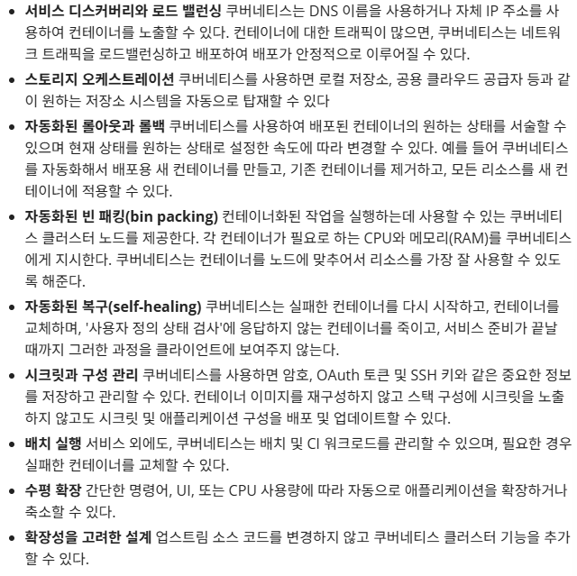
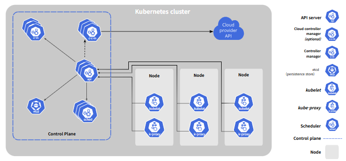

# 쿠버네티스 컴포넌트

# 쿠버네티스

컨테이너화된 워크로드와 서비스를 관리하기 위해 이식/확장이 가능한 오픈소스 플랫폼
*KU7s 표기: “KU”와 “s” 사이에 있는 7글자를 나타내는 약식 표기

### 필요성

애플리케이션을 포장하고 실행하는 방법 중 하나로 컨테이너 방법을 사용
→ 컨테이너의 가동 시간/환경 관리 → 시스템에서 처리한다면?

- 쿠버네티스는 분산 시스템을 탄력적으로 실행하기 위한 프레임 워크 제공 

- 애플리케이션의 확장과 장애 조치 처리, 배포 패턴 등을 제공

# 쿠버네티스 컴포넌트

쿠버네티스 클러스터는 크게 두 부분으로 나뉜다.

### 0. 쿠버네티스 클러스터란?

컨테이너화된 애플리케이션을 배포하고 관리하기 위한 컴퓨터들의 집합

→ 여러 대의 서버(물리적 or 가상머신)를 하나의 거대한 시스템처럼 묶은 것

→ Contral Plane + 여러 Node

### 0-1. Pod란?

쿠버네티스에서 “컨테이너를 감싸는 가장 작은 실행 단위”

컨테이너 1개 이상을 하나로 묶어 같은 네트워크-스토리지를 공유하게 만드는 논리적 단위

→ Docker: 컨테이너 = 하나의 앱 / KU7s: 컨테이너를 Pod란 상자에 넣어 관리

**Pod = 컨테이너 + 실행환경 정보 (ex. 네트워크(IP), 볼륨(Storage))**

[ Node ]
└── [ Pod ]
├── [ Container A (예: nginx) ]
├── [ Container B (예: log collector) ]
├── 공유 네트워크 (IP, 포트)
└── 공유 볼륨 (저장공간)

→ Node에서 **kubelet**이 Pod 생성-관리

→ Pod 자체가 죽으면 쿠버네티스가 알아서 같은 구성의 새 Pod를 생성

### 1. Kubernetes System Flow

1. 사용자가 명령을 내림 (kubectl → API Server)
    
    사용자의 요청은 API Server로 전달 
    
    → 쿠버네티스의 모든 동장은 API Server를 통해서만 이루어짐
    
2. API Sever → etcd에 상태 저장
    
    API Server는 요청을 검증/인증 → Desired State를 etcd에 기록
    (Desired State = “이런 리소스(Deployment, Pod 등)가 필요하다”)
    
3. kube-controller-manager가 변화 감시 및 동작 수행
    
    ectd를 지속적으로 감시하며 Desired State와 Current State를 비교
    → 차이가 있으면 자동으로 Pod 생성 요청 (→ API Server에 전달)
    
4. Scheduler가 Pod을 배치할 Node 결정
    
    “어느 Node에 새 Pod를 띄울까?“를 결정 → 그 정보를 API Server에 전달 → etcd에 기록
    
5. Node의 kubelet이 Pod 생성
    
    kubelet은 주기적으로 API Server를 확인하며 “내가 맡을 Pod이 생겼나?” 확인 → 필요 시, container runtime을 이용해 컨테이너 실행
    
6. kube-proxy가 네트워크 연결 설정
    
    Pod이 실행되면 kube-proxy가 네트워크 규칙(iptable/IPVS)을 설정해 Pod 간 통신 & 외부 클라이언트 ↔ Service ↔ Pod 연결을 가능하게 함
    
7. Add-ons이 부가 기능 제공

8. 상태 동기화 및 자동 복구
    
    kubelt이 Pod 상태를 API Server에 보고 → k-cm는 이를 etcd에서 확인(Desired State = Current State 인가)
    
    - if Pod이 죽거나 Node가 중단되면?
        
        k-cm가 새로운 Pod를 다른 Node에 자동 배포
        
    
    → 쿠버네티스는 스스로 상태를 복원하며 “항상 일정한 상태 유지”
    

[사용자] ──kubectl──▶ [API Server]
│                │
│                ▼
│           [etcd 저장소]
│                │
▼                ▼
[Controller Manager]──▶ (변화 감시 및 조정)
│
▼
[Scheduler] ──▶ (Pod 배치 결정)
│
▼
[Node의 kubelet] ──▶ (Pod 생성 및 실행)
│
├── [container runtime] (컨테이너 실행)
└── [kube-proxy] (네트워크 설정)

+ Add-ons (CoreDNS, Dashboard, Metrics, Ingress …)

### 2. Control Plane (컨트롤 플레인)

클러스터 전체를 관리-제어하는 두뇌 역할 (ex. 명령을 내리자 관리자)

어떤 pod이 어디(Node)에 배치될 지, 상태가 정상인지 등을 판단

**구성요소** 

- kube-apiserver
    - 모든 명령의 “입구”
    - 클라이언트가 쿠버네티스에 요청을 보낼 떄 API Server을 통해 전달
- etcd
    - 클러스터의 DB 역할 (key-value 저장소)
    - 현재 상태, 구성 정보 등을 저장 (ex. 어떤 pod가 어디에 있나)
- kube-controller-manager
    - 클러스터 상태를 지속적으로 감시하고 현재 상태를 원하는 상태(Desired State)로 맞추는 역할 (ex. Pod이 죽었으면 새로 생성)
- kube-scheduler
    - 노드가 배정되지 않은 새로 생성된 Pod이 “어떤 Node”에서 실행될 지 결정
    - 각 Node의 리소스 상황(CPU, Memory, Taint 등)을 고려해 배치
- Cloud-controller-manager (CCM)
    - 클라우드 환경(AWS, GCP 등)에서 인프라 API와 연동
    - 로드밸런서 생성, 노드 상태 감시, 스토리지 연결 등 클라우드 관련 기능 처리 (ex. 클라우드 업체와 통화하는 중개인st)

### 3. Node Component (노드 컴포넌트)

실제로 애플리케이션(컨네이너)이 실행되는 서버 (ex. 일하는 직원)

실제 Pod를 실행하고 유지

**구성요소** 

- kubelet
    - 각 Node에서 Pod 실행 상태를 관리
    - Control Plane과 통신하며 “Pod이 잘 돌고 있는가” 확인
- kube-proxy
    - 네트워크 관리 (ex. Pod /  외부 간 통신 라우팅 담당)
- Container Runtime
    - 실제 컨테이너를 실행시키는 엔진 (ex. containerd, CRI-O, Docker)

### 4. ADD Component

| 컴포넌트 | 설명 |
| --- | --- |
| kubectl (클라이언트) | 사용자가 명령을 내리는 도구 (kubectl apply, get pods 등) |
| Add-ons (추가 기능) | DNS, Dashboard, Monitoring, Ingress Cotroller 등 클러스터 기능 확장용 |

### 4-1. Add ons (애드온)

| 기능 영역 | 주요 Add-on | 설명 |
| --- | --- | --- |
| Network | CoreDNS | 클러스터 내부에서 Pod 이름을 IP로 변환 |
| 대시보드(UI) | Kubernetes Dashboard | 웹 기반 관리 UI, kubectl 없이 Pod/Deployment 등을 시각적으로 관리 가능 |
| Monitoring | Metrics Server | CPU-메모리 사용량 수집 및 시각화 |
| Logging | EFK Stack (Elasticsearch +Fluentd + Kibana) | 클러스터 전체의 로그를 중앙 수집/검색/시각화 |
| Network 정책 | Calico, Flannel | Pod 간 네트워크 규칙 관리 및 보안 정책 적용 |
| Ingress Controller | Nginx, Traefik | 외부 트래픽을 클러스터 내부 서비스로 라우팅 |
| Storage 관리 | CSI 플러그 인 | 외부 스토리지(AWS EBS, NFS 등) 연결 자동화 |