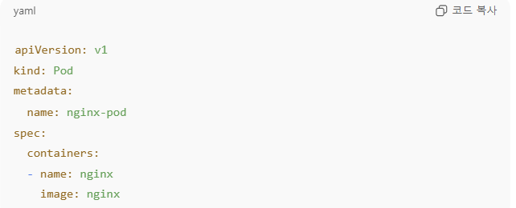
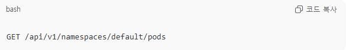
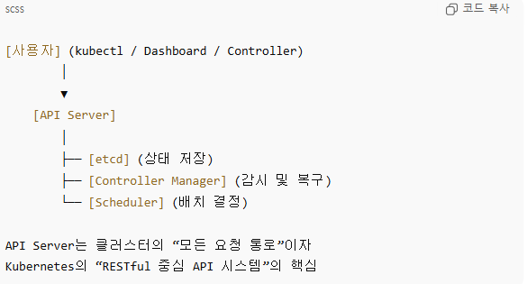

# 쿠버네티스 API

### 0. Kubernetes API

쿠버네티스의 모든 동작은 API 호출로 이루어짐

- kebectl, Dashboard, Controller 등 : API Server에 요청을 보내는 클라이언트

→ kubernetes = API 중심으로 설계된 시스템

### 1. Resource & Object

쿠버네티스의 모든 Entity(Pod, Deployment, Service 등) → API 리소스로 표현

- 예시
    
    `/api/v1/pods` → Pod 목록
    
    `/apis/apps/v1/deployments` → Deployment 목록
    

각각의 리소스는 JSON / YAML 형태로 표현됨

→ 이 YAML을 `kubectl apply` 하면 `API Server`에 HTTP POST 요청을 보내 새 Pod 리소스를 생성하는 것과 같음

### 2. API Groups

리소스를 기능별 그룹으로 나눠 관리한다.

| API 그룹 이름              | 대표 리소스                             | 설명/기능                                                |
| ------------------------- | ------------------------------------- | ------------------------------------------------------- |                       
| core (v1)                 | Pod, Service(네트워크), ConfigMap(설정) | 쿠버네티스 기본 리소스                                     |
| apps                      | Deployment, DaemonSet, Statefulset    | 애플리케이션 실행 관리용 리소스Pod를 묶고 자동 복구 관리       |
| batch                     | Job, CronJob                          | 일회성-주기적 작업 수행용 리소스ex. 스케줄러 기반 작업         |
| rbac.authorization.k8s.io | Role, RoleBinding, ClusterRole        | 리소스 사용량에 따라 Pod 수 조정 CPU/메모리 기반 스케일링 지원 |
| autoscaling               | HorizontalPodAutoscaler               | 권한 관리                                                |

### 3. API 버전 관리 (Versioning)

→ YAML 파일에서 `apiVersion:` 항목

| 버전 이름            | 의미                        |
| ------------------- | -------------------------- |
| alpha (ex. v1alpha) | 실험 단계, 자주 변경 가능     |
| beta (ex. v1beta)   | 안정화 중, 다만 일부 변경 가능 |
| stable (ex. v1)     | 안정화 완료, 장기간 유지 보장  |

### 4. OpenAPI & API Reference

쿠버네티스 API: OpenAPI 스펙(JSON 형식)으로 제공

즉, 다른 애플리케이션이 쿠버네티스와 직접 통신하거나 자동화할 때,

→ 이 API 스팩을 이용해서 프로그래밍이 가능 (ex. Python, Go SDK 등)

개발자는 “REST API 서버”로 접근 가능

→ Pod 목록을 JSON으로 반환

### 5. Server-Side Apply

YAML을 단순히 덮어쓰는 대신, 쿠버네티스 서버(API Server)가 리소스 병합/충돌 관리를 대신 수행

`kubectl apply --server-side` 명령으로 사용 가능

운영 중 리소스 관리 자동화를 위해 많이 사용

### 6. 전체 구조 정리

