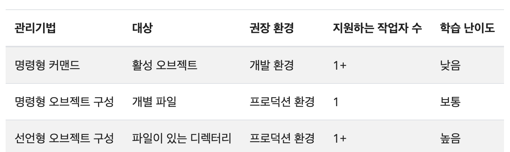

# 쿠버네티스 오브젝트 관리

kubectl CLI 툴은 오브젝트를 생성하고 관리하기위한 방법을 제공함

## 관리 기법

> 쿠버네티스 오브젝트는 하나의 기법만 사용해 관리해야하고 여러 기법을 혼용할 경우 문제가 발생함



### 명령형 커맨드(Impernative Commands)

kubectl 명령에 인수 또는 옵션을 사용해 애플리케이션을 관리하는 방법

- 권장 환경: 개발 환경 → 일회성 작업
  - 활성 오브젝트에 직접적인 영향을 미치기 때문
  - 이전 구성의 이력을 제공하지 않음
- 예시
  Deployment 오브젝트를 생성해 nginx 컨테이너의 인스턴스를 구동
    <aside>
    
    Container instance: 컨테이너 이미지를 실제로 실행시켜 만들어진 하나의 실행 중인 컨테이너 ↔ Container image: 정적인 템플릿
    
    </aside>
    
    ```bash
    kubectl create deployment nginx --image nginx
    ```

- 장점과 단점
  오브젝트 구성에 비해…
  - 클러스터를 수정하기 위해 단 하나의 단계를 사용
  - 변경 검토 프로세스와 통합되지 않음
  - 변경에 관한 감시 추적 불가능
  - 동작 중인 경우를 제외하고는 레코드의 리소스 제공 불가능
  - 새로운 오브젝트 생성을 위한 템플릿 미제공

### 명령형 오브젝트 구성

오브젝트를 .yaml 또는 json 형식으로 정의하는 방법-

- 예시
  - 구성 파일에 정의된 오브젝트를 생성
    ```bash
    kubectl create -f nginx.yaml
    ```
  - 2개의 구성 파일에 정의된 오브젝트를 삭제
    ```bash
    kubectl delete -f nginx.yaml -f redis.yaml
    ```
  - 활성 동작하는 구성을 덮어써 오브젝트 업데이트
    ```bash
    kubectl replace -f nignx.yaml
    ```
    replace 명령어는 기존 spec을 새로운 spec으로 바꾸고 구성 파일에서 누락된 오브젝트의 모든 변경 사항을 삭제하는데, 그렇기 때문에 spec이 구성 파일과는 별개로 업데이트되는 리소스 유형의 경우 사용 금지
- 장점과 단점
  명령형 커맨드에 비해…
  - Git과 같은 소스 컨트롤 시스템에 보관가능
  - 변경 사항 검토 프로세스와 통합 가능
  - 새로운 오브젝트 생성을 위한 템플릿 제공
  - 오브젝트 스키마에 대한 필요
  - yaml 파일을 기록하는 추가적인 단계 필요
  선언형 오브젝트 구성에 비해…
  - 간결하고 이해하기 쉬움
  - 디렉터리가 아닌 파일에 가장 적합
  - 활성 오브젝트에 대한 업데이트는 구성 파일에 반영되어야하고, 아닐 경우 다음 교체 중에 손실(replace 명령어)

### 선언형 오브젝트 구성

특정 디렉토리에 모든 오브젝트 파일을 배치하고 생성, 업데이트, 삭제 작업이 kubectl에 의해 오브젝트마다 자동으로 감지됨

- 예시
  - configs 디렉토리 내 모든 오브젝트 구성 파일을 넣어 활성 오브젝트를 생성 또는 패치(이미 실행 중인 오브젝트의 일부 설정을 바로 수정)
    어떤 변경이 생기는지 diff 명령어를 통해 미리 확인 가능
    ```bash
    kubectl diff -f configs/
    kubectl apply -f configs/
    ```
    replace API 대신 patch API를 사용하기 때문에 활성 오브젝트에 직접 작성된 변경 사항이 로컬 구성 파일에 반영되지 않아도 유지됨
- 장점과 단점
  명령형 오브젝트 구성에 비해…
  - patch API를 사용하는 점
  - 디렉터리에서의 작업 및 오브젝트 별 작업에 대한 더 나은 지원
  - 예상치 못한 결과를 디버깅하고 이해하기 어려움
  - diff를 사용한 부분 업데이트는 복잡한 병합 및 패치 작업을 유발

---

| 구분          | 명령형 커맨드      | 명령형 오브젝트 구성        | 선언형 오브젝트 구성                |
| ------------- | ------------------ | --------------------------- | ----------------------------------- |
| 특징          | 단일 명령          | YAML로 정의 후 명령         | 디렉터리 내 다중 오브젝트 직접 감지 |
| API 호출 방식 | 직접 create/update | replace API                 | patch API                           |
| 상태 관리     | 일회성             | YAML에 정의된 상태로 동기화 | YAML 기준 자동 동기화               |
| 실시간 변경   | 수동 재실행 필요   | replace를 사용해 덮어쓰기   | 자동 병함 및 유지                   |
| 적합한 환경   | 개발/테스트        | 소규모 배포                 | 운영/프로덕션, CI/CD                |
