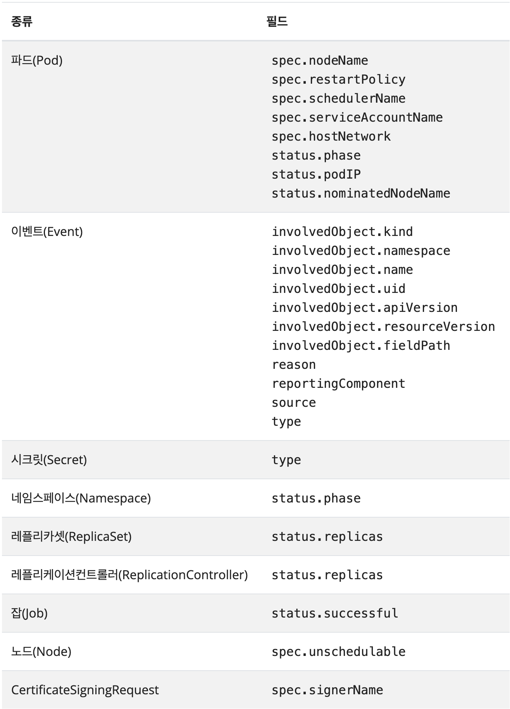

### 필드셀렉터

---

<aside>

오브젝트의 **필드(Field) 값**을 보고 원하는 것만 **선택(Select)** 하는 기능

</aside>

`.` 을 사용해서 특정 필드에 접근할 수 있다.

- `metadata.name=my-service`
  - 이름(name)이 정확히 `my-service`인 것을 찾아
- `metadata.namespace!=default`
  - 소속된 네임스페이스(namespace)가 `default`가 아닌(!=) 것을 찾아
- `status.phase=Pending`
  - 현재 상태(phase)가 `Pending`(대기중)인 것을 찾아

`kubectl` 명령어와 함께 사용할 수 있다.

```yaml
kubectl get pods --field-selector status.phase=Running
```

<aside>

---

**참고**

필드 셀렉터는 본질적으로 리소스 *필터이다.*

- `kubectl get pods` 와 `kubectl get pods --field-selector ""` 는 동일
</aside>

---

### 사용 가능한 필드

사용 가능한 필드는 쿠버네티스의 리소스 종류에 따라 다르다.

모든 리소스 종류는 `metadata.name` , `metadata.namespace` 필드 셀렉터를 사용할 수 있다.

사용할 수 없는 셀렉터를 사용하면 아래의 에러를 출력한다.

```yaml
Error from server (BadRequest): Unable to find "ingresses" that match label selector "", field selector "foo.bar=baz": "foo.bar" is not a known field selector: only "metadata.name", "metadata.namespace"
```



**커스텀 리소스 필드**

- 사용자가 직접 새로운 종류의 리소스(Custom Resource)를 만들었을 때, `metadata.name`과 `metadata.namespace`는 기본으로 지원한다.
- 만약 다른 필드도 검색할 수 있게 하고 싶다면, 해당 커스텀 리소스의 설계도(CRD)에 `"이 필드들도 검색할 수 있게 해주세요"` 라고 `selectableFields` 항목에 직접 정의해줘야 한다.

---

### 사용 가능한 연산자

필드 셀렉터에서 `=`, `==`, `!=` 연산자를 사용할 수 있다 (`=`와 `==`는 동일한 의미이다).

예를 들면, 아래의 `kubectl` 커맨드는 `default` 네임스페이스에 속해있지 않은 모든 쿠버네티스 서비스를 선택한다.

```bash
kubectl get services  --all-namespaces --field-selector metadata.namespace!=default
```

<aside>

참고

- [집합 기반 연산자](https://kubernetes.io/ko/docs/concepts/overview/working-with-objects/labels/#set-based-requirement) (`in`, `notin`, `exists`)는 필드 셀렉터에서 사용할 수 없다.\*\*
</aside>

---

### 연계되는 셀렉터

[레이블](https://kubernetes.io/ko/docs/concepts/overview/working-with-objects/labels)을 비롯한 다른 셀렉터처럼, 쉼표로 구분되는 목록을 통해 필드 셀렉터를 연계해서 사용할 수 있다.

아래의 `kubectl` 커맨드는 `status.phase` 필드가 `Running` 이 아니고, `spec.restartPolicy`  필드가 `Always` 인 모든 파드를 선택한다.

```bash
kubectl get pods --field-selector=status.phase!=Running
																,spec.restartPolicy=Always
```

---

### 여러 개의 리소스 종류

필드 셀렉터를 여러 개의 리소스 종류에 걸쳐 사용할 수 있다.

여러 조건을 동시에 만족하는 대상을 찾고 싶을 때는 쉼표(`,`)로 조건(=AND)을 쭉 이어서 쓰면 된다.

```bash
kubectl get statefulsets,
	services --all-namespaces --field-selector metadata.namespace!=default
```
