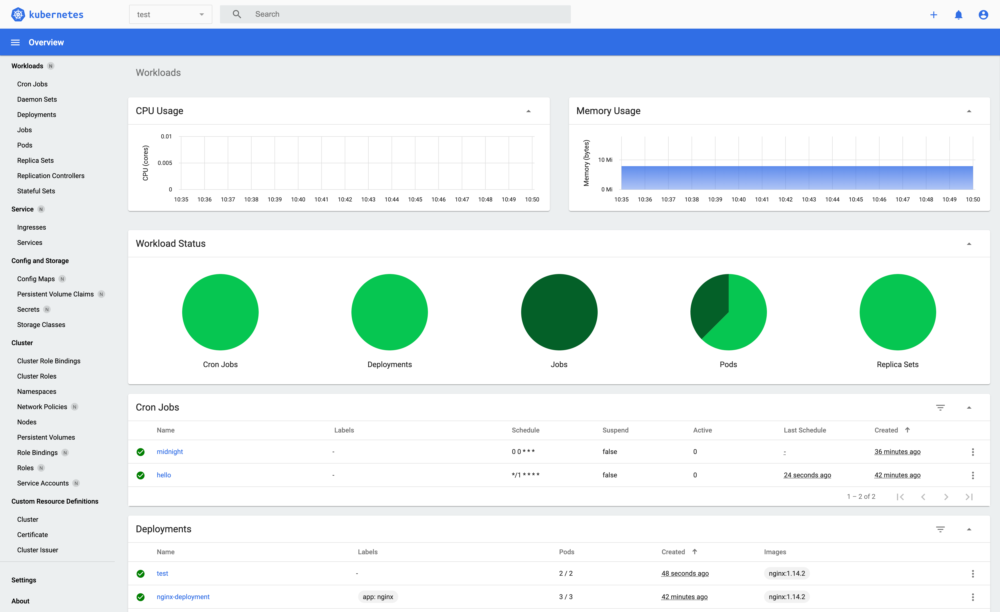

# 클러스터 아키텍쳐

> 쿠버네티스 뒤편의 구조와 설계 개념들에 대해 알아본다.
> 이 문서는 쿠버네티스 클러스터를 구성하기 위해 필요한 다양한 컴포넌트를 설명한다.

> 쿠버네티스는 Ch1(쿠버네티스란 무엇인가?)에서 언급한 바와 같이 컨트롤 플레인과 노드라고 불리는 일련의 워커 머신으로 구성되어 있다.
> 이 노드는 각각의 컨테이너화된 애플리케이션을 실행한다.
> 모든 클러스터는 파드를 실행하기 위해 최소한 하나의 워커 노드가 필요하다.

> 워커 노드는 애플리케이션 워크로드의 구성 요소인 파드를 호스팅한다.

→ 애플리케이션 워크로드: 서비스, 프로그램 전체

→ 파드: 프론트엔드, 백엔드 API, DB.. 에 각각 1개씩 할당

- 워크로드란?
  - 쿠버네티스에서 실행되는 애플리케이션이나 작업
  - etc: 웹 서버 어플리케이션, DB, API 서버..
  - “워크로드를 실행한다” → “애플리케이션을 돌린다”
- 호스팅?
  - **호스팅**은 프로그램이나 애플리케이션을 **실행할 수 있는 환경을 제공**하는 것
- 워커 노드가 파드를 호스팅한다 = 워커 노드가 파드를 자기 안에서 실행시킨다라고 보면 된다.

<br>

> 컨트롤 플레인은 클러스터 내의 워커 노드와 파드를 관리한다.
> 프로덕션 환경에서, 컨트롤 플레인은 보통 여러 대의 컴퓨터에서 실행된다.

- **왜?**
  **1. 장애 대비 (고가용성)**
  - 컨트롤 플레인이 1대만 있으면, 그 컴퓨터가 고장나면 전체 클러스터 관리가 불가능
  - 여러 대에 분산하면, 하나가 고장나도 다른 것이 계속 작동
    **2. 부하 분산**
  - 대규모 클러스터에서는 관리 작업도 많아짐
  - 여러 컴퓨터가 나눠서 처리하면 효율적

<br>

> 클러스터는 일반적으로 여러 개의 노드를 실행하여, 장애 허용성과 고가용성을 제공한다.

- How?
  - **복제 (Replication)**
    - 같은 애플리케이션을 여러 노드에 복사해서 실행
    - 예: 웹 서버 파드를 3개 노드에 각각 1개씩 배치
  - **자동 복구 (Self-healing)**
    - 노드 A가 고장나면, 쿠버네티스가 자동으로 노드 B에 파드를 새로 생성
    - 사용자는 서비스 중단을 거의 느끼지 못함
  - **로드 밸런싱**
    - 트래픽을 여러 노드에 분산
    - 한 노드에 부하가 집중되지 않도록 관리

---

**쿠버네티스 클러스터 컴포넌트**

> 아래 그림은 쿠버네티스 클러스터에 대한 예시 참조 아키텍쳐를 나타낸다.
> 실제 분포는 특정 클러스터의 설정과 요구사항에 따라 달라질 수 있다.


다이어그램에서, 각 노드(Node 1, Node 2)는 [`kube-proxy`](https://kubernetes.io/ko/docs/concepts/architecture/#kube-proxy) 컴포넌트를 실행한다.

- 클러스터 네트워크에서 서비스 API와 관련 동작을 사용할 수 있도록 각 노드에는 네트워크 프록시 컴포넌트가 필요하다.
- 그러나, 일부 네트워크 플러그인은 자체 서드파티 프록시 구현을 제공한다.
  - 그러한 네트워크 플러그인을 사용할 경우, 해당 노드에서 `kube-proxy` 를 실행할 필요가 없다.

---

## 컨트롤 플레인 컴포넌트

회사의 경영진처럼 전체적인 결정을 내리고 관리하는 부분이라고 보자.

> 클러스터에 대한 전역적인 결정(etc: 스케줄링)뿐만 아니라, 클러스터의 이벤트를 감지하고 대응한다.
> → 예를 들어, deployment의 replica 필드가 충족되지 않을 때 파드를 새로 시작

1. **전역적인 결정 (Global Decisions)**

- "이 파드는 어느 노드에서 실행시킬까?" → **스케줄링 (Scheduling)**
- "리소스가 부족하면 어떤 파드를 먼저 제거할까?" → **우선순위 결정**

1. **이벤트 감지 및 대응 (Detecting & Responding)**

- Deployment에서 "replica: 3"으로 설정했는데 파드가 2개만 실행 중?
  → 자동으로 1개 더 시작
- 노드 하나가 다운되었다?
  → 그 노드에 있던 파드들을 다른 노드로 옮김

> 컨트롤 플레인 컴포넌트는 클러스터 안의 어떤 머신에서도 실행될 수 있다.

- 가능한 배치 옵션들로는 예시로 아래와 같다.
  - 단일 마스터 노드
  - 고가용성(HA) 구성: 마스터 노드1, 2, 3을 만들고 컨트롤 플레인이 안에서 실행되며 고가용성을 확보
  - etc…

> 그러나 설정 스크립트는 일반적으로 모든 컴포넌트를 동일한 머신에서 시작하며, 이 머신에서는 사용자 컨테이너를 실행하지 않는다.

대부분의 경우, 컨트롤 플레인 컴포넌트들은 **한 곳에 모아서** 실행한다.

- 하지만 사용자 컨테이너는 클러스터 관리 컴포넌트에 접근 하는 것이 보안 위험에 문제가 될 수 있기 때문에 둘이 실행되는 머신을 분리한다.

> 여러 머신에 걸쳐 컨트롤 플레인을 실행하는 예시 설정은 https://kubernetes.io/docs/setup/production-environment/tools/kubeadm/high-availability/에서 참고한다.

---

### kube-apiserver

쿠버네티스의 정문 역할을 하며, 마치 회사의 접수 데스크처럼, 모든 요청을 받아서 처리한다.

- 즉, 모든 명령, 통신이 이곳을 통해 이뤄지고
- 여러 개를 실행해서 부하를 분산시킬 수도 있다.

> API 서버는 쿠버네티스 API를 노출하는 쿠버네티스 컨트롤 플레인 컴포넌트이다.
> API 서버는 쿠버네티스 컨트롤 플레인의 프론트 엔드다.

> 쿠버네티스 API 서버의 주요 구현은 kube-apiserver이다.
> kube-apiserver는 수평으로 확장되도록 디자인되었다.
> 즉, 더 많은 인스턴스를 배포해서 확장할 수 있다.
> 여러 kube-apiserver 인스턴스를 실행하고, 인스턴스간의 트래픽을 균형있게 조절할 수 있다.

### etcd

> 모든 클러스터 데이터를 담는 쿠버네티스 뒷단의 저장소로 사용되는 일관성/고가용성 키-값 저장소이다.
> 쿠버네티스 클러스터에서 etcd를 뒷단의 저장소로 사용한다면, 이 데이터를 [백업](https://kubernetes.io/docs/tasks/administer-cluster/configure-upgrade-etcd/#backing-up-an-etcd-cluster)하는 계획을 가져야 한다.
> 자세한 정보는 공식 [문서](https://etcd.io/docs)를 참고하자.

### kube-scheduler

> 노드가 배정되지 않은 새로 생성된 파드를 감지하고, 실행할 노드를 선택하는 컨트롤 플레인 컴포넌트이다.
> 스케줄링 결정을 위해 고려되는 요소는 리소스에 대한 개별 및 총체적 요구 사항, 하드웨어/소프트웨어/정책적 제약, 어피니티(affinity)및 안티-어피티니 명세, 데이터 지역성, 워크로드-간 간섭, 데드라인을 포함한다.

- 어피니티? → 특정 조건의 노드를 선호하는지
- 데이터 지역성? → 데이터가 있는 곳 근처에 파드 배치
- 워크로드-간 간섭? → 파드끼리 서로 방해하지 않게 배치하기
- 데드라인? → 특정 시간까지 완료되어야 하는지 확인

### kube-controller-manager

여러 컨트롤러를 실행하여 클러스터 상태를 관리하는 관리자다.

> 컨트롤러 프로세스를 실행하는 컨트롤 플레인 컴포넌트
> 논리적으로, 각 컨트롤러는 분리된 프로세스이지만, 복잡성을 낮추기 위해 모두 단일 바이너리로 컴파일되고 단일 프로세스 내에서 실행된다.

- 모든 컨트롤러를 하나의 바이너리로 컴파일 → 하나의 프로세스로 실행한다.
  - 하나의 프로그램 안에 여러 Controller들이 결국 붙어있다.

> 컨트롤러에는 여러 가지 유형이 있다. 몇 가지 예시는 다음과 같다.

- 노드 컨트롤러(Node Controller): 노드가 다운될 때 이를 감지하고 대응한다.
- 잡 컨트롤러(Job Controller): 일회성 작업을 나타내는 잡(Job) 오브젝트를 감시하고, 해당 작업을 수행하기 위한 파드를 생성한다.
- 엔드포인트슬라이스 컨트롤러(EndpointSlice controller): 엔드포인트슬라이스 오브젝트를 채워서 파드와 서비스 사이의 연결을 제공한다.
- 서비스어카운트 컨트롤러(ServiceAccount controller): 신규 네임스페이스에 기본 서비스어카운트를 생성한다.
  >

kube-controller-manager는 다양한 컨트롤러를 실행하며, 각 컨트롤러는 특정 리소스를 감시하고 관리한다.

- 엔드포인트슬라이스 컨트롤러

  - 엔드포인트슬라이스: Service를 통해 Pod에 접근할 때 필요한 주소록.

  ```swift
  EndpointSlice Controller:
  "Service 'web-service'가 생성되었네"
  "selector가 app=web이군"
  "app=web 레이블을 가진 Pod를 찾아보자"

  [Pod 검색]
  - web-1: IP 10.244.1.5, 포트 8080 ✓
  - web-2: IP 10.244.2.10, 포트 8080 ✓
  - web-3: IP 10.244.3.15, 포트 8080 ✓

  "EndpointSlice 오브젝트를 만들어야겠어"

  [EndpointSlice 생성]
  ```

- 서비스어카운트 컨트롤러

  - Service Account: Pod가 Kubernetes API에 접근할 때 사용하는 신원 정보

  ```bash
  # 1. 네임스페이스 생성
  $ kubectl create namespace production
  namespace/production created

  # 2. 즉시 ServiceAccount 확인 (이미 생성됨!)
  $ kubectl get sa -n production
  NAME      SECRETS   AGE
  default   0         1s
            ↑ ServiceAccount Controller가 자동 생성!

  # 3. 이 네임스페이스에 Pod 생성
  $ kubectl run nginx --image=nginx -n production

  # 4. Pod가 자동으로 default ServiceAccount 사용
  $ kubectl get pod nginx -n production -o jsonpath='{.spec.serviceAccountName}'
  default
  ```

### 클라우드 컨트롤 매니저

클라우드 서비스와 연동하는 역할로, AWS, GCP같은 클라우드와 통신하는 통역사라고 볼 수 있다.

- 클라우드 로드밸런서 생성/관리
- 클라우드 스토리지 연결
- 노드가 클라우드에서 삭제되었는지 확인

> 클라우드별 컨트롤 로직을 포함하는 쿠버네티스 [컨트롤 플레인](https://kubernetes.io/ko/docs/reference/glossary/?all=true#term-control-plane) 컴포넌트이다.
> 클라우드 컨트롤러 매니저를 통해 클러스터를 클라우드 공급자의 API에 연결하고, 해당 클라우드 플랫폼과 상호 작용하는 컴포넌트와 클러스터와만 상호 작용하는 컴포넌트를 구분할 수 있게 해준다.

- kube-controller-manager / cloud-controller-manager를 구분함으로써 코드를 분리한다.
  - 이를 통해 온프레미스 환경에서는 불필요한 코드 제거도 가능하고
  - 클라우드 부분을 수정할 때 독립성을 가질 수 있다.

> 클라우드 컨트롤러 매니저는 오직 클라우드 공급자에 특화된 컨트롤러만 실행한다.
> 쿠버네티스를 온프레미스 환경이나, 개인 PC의 학습환경에서 실행하는 경우, 클러스터에는 클라우드 컨트롤러 매니저가 없다.

| 환경                             | cloud-controller-manager |
| -------------------------------- | ------------------------ |
| **AWS, GCP, Azure**              | ✓ 필요                   |
| **온프레미스 (자체 데이터센터)** | ❌ 없음                  |
| **개인 PC (minikube, kind)**     | ❌ 없음                  |

> kube-controller-manager와 마찬가지로, 클라우드 컨트롤러 매니저는 여러 개의 논리적으로 독립된 컨트롤 루프를 단일 바이너리로 결합하여 하나의 프로세스로 실행한다.

kube-controller-manager와 **동일한 구조다.**

- 여러 컨트롤러를 하나의 프로그램에 포함
- 하나의 프로세스로 실행
- 효율적인 리소스 사용

> 성능을 향상시키거나 장애 허용성을 높이기 위해 수평 확장(하나 이상의 복제본을 실행)할 수 있다.

> 다음과 같은 컨트롤러는 클라우드 공급자 의존성을 가질 수 있다.

- 노드 컨트롤러(Node controller): 노드가 응답을 멈춘 뒤 클라우드에서 해당 노드가 삭제되었는지를 판단하기 위해 클라우드 공급자를 확인한다.

  - 노드가 죽었는지, 아니면 클라우드에서 실제로 삭제된 것인지를 확인

- 라우트 컨트롤러(Route controller): 클라우드 인프라스트럭처 기반에서 라우트를 설정한다.
  - Pod간 네트워크 통신을 위해 클라우드의 라우팅 테이블을 자동으로 설정
- 서비스 컨트롤러(Service controller): 클라우드 공급자의 로드 밸런서를 생성, 업데이트, 삭제한다.
  - LoadBalancer 타입의 Service를 만들면 클라우드 로드 밸런서를 자동으로 생성한다.

---

## 노드 컴포넌트

실제로 일(애플리케이션 실행)을 하는 워커 머신들 → 일꾼들!

> 노드 컴포넌트는 모든 노드에서 실행되며, 실행 중인 파드를 유지하고 쿠버네티스 런타임 환경을 제공한다.

### kubelet

> 클러스터의 각 노드에서 실행되는 에이전트다.
> kubelet은 파드에서 컨테이너가 확실하게 동작하도록 관리한다.
> 다양한 메커니즘을 통해 제공된 파드 스펙(PodSpec)의 집합을 받아서 컨테이너가 해당 파드 스펙에 따라 건강하게 동작하는 것을 확실히 한다.
> kubelet은 쿠버네티스를 통해 생성되지 않는 컨테이너는 관리하지 않는다.

### kube-proxy (선택 사항)

네트워크 통신을 관리하는 오브젝트로, 우체국처럼 패킷을 올바른 목적지로 전달하는 역할을 한다.

> kube-proxy는 클러스터의 각 [노드](https://kubernetes.io/ko/docs/concepts/architecture/nodes/)에서 실행되는 네트워크 프록시로, 쿠버네티스의 [서비스](https://kubernetes.io/ko/docs/concepts/services-networking/service/) 개념의 구현부이다.

- Service의 가상 IP를 실제 파드 IP로 변환해주는 핵심 컴포넌트라고 앞에서 설명했다.
  - kube-proxy가 없으면 Service가 작동하지 않음

> kube-proxy는 노드의 네트워크 규칙을 유지 관리한다.
> 이 네트워크 규칙이 내부 네트워크 세션이나 클러스터 바깥에서 파드로 네트워크 통신을 할 수 있도록 해준다.

- **네트워크 규칙이란?**
  - "Service IP:Port → 파드 IP:Port" 매핑 규칙
  - 파드가 추가/삭제될 때마다 자동으로 규칙 업데이트
- **내부 통신**: 파드 ↔ 파드 (Service 이름으로 접근)
- **외부 통신**: 인터넷 → NodePort/LoadBalancer → 파드

> kube-proxy는 운영 체제에 가용한 패킷 필터링 계층이 있는 경우, 이를 사용한다. 없다면, 트래픽 자체를 포워드(forward)한다.

- 패킷 필터링 계층: 운영 체제의 네트워크 처리 기능. 리눅스에서는 주로 아래 모드를 사용한다.
  - **iptables 모드**: 리눅스 iptables 규칙으로 패킷 변환 (기본값)
  - **IPVS 모드**: 더 빠른 로드밸런싱, 대규모 클러스터에 적합
- 만약 패킷 필터링 계층이 없다면 kube-proxy가 직접 트래픽을 전달한다.

> 서비스에 대한 패킷 포워딩을 자체적으로 구현하고, kube-proxy와 동등한 동작을 제공하는 네트워크 플러그인을 사용하는 경우, 클러스터 노드에서 kube-proxy를 실행할 필요가 없다.

- 앞에서 말했듯이 네트워크 플러그인을 사용하면 필요없음!

### 컨테이너 런타임

> 컨테이너 실행을 담당하는 소프트웨어이다.
> 쿠버네티스는 [containerd](https://containerd.io/docs/), [CRI-O](https://cri-o.io/#what-is-cri-o)와 같은 컨테이너 런타임 및 모든 [Kubernetes CRI (컨테이너 런타임 인터페이스)](https://github.com/kubernetes/community/blob/master/contributors/devel/sig-node/container-runtime-interface.md) 구현체를 지원한다.

- 뒤에서 자세히 나온다.

---

## 애드온

클러스터에 추가 기능을 제공하는 선택적 구성 요소들.

- 기본 쿠버네티스 위에 올리는 `확장팩`같은 느낌.

> 쿠버네티스 리소스(데몬셋(DaemonSet), 디플로이먼트(Deployment), 등)를 사용하여, 클러스터의 기능을 구현한다.
> 클러스터 수준의 기능을 제공하기 때문에, 애드온의 네임스페이스 리소스는 `kube-system` 네임스페이스에 속한다.

> 선택된 애드온은 아래에 설명되어 있다. 사용 가능한 애드온의 더 많은 목록은, [애드온](https://kubernetes.io/ko/docs/concepts/cluster-administration/addons/)을 참고한다.

### DNS

> 다른 애드온들은 반드시 필요하지 않지만, 많은 예제가 이를 기반으로 하기에, 모든 클러스터에는 [클러스터 DNS](https://kubernetes.io/ko/docs/concepts/services-networking/dns-pod-service/)가 있어야 한다.

클러스터 DNS란?

- 쿠버네티스 클러스터 내부에서 이름으로 서비스를 찾을 수 있게 해주는 DNS 서버다.
  - 실제 IP 주소는 변경이 자주 된다.
    - 변경을 안한다 해도, 직접 사용하는 것은 불편하다.

> 클러스터 DNS는 쿠버네티스 서비스에 대한 DNS 레코드를 제공하는 DNS 서버로, 사용자 환경에 있는 다른 DNS 서버와 별개로 동작한다.

- **클러스터 DNS는 쿠버네티스 전용 DNS다. 외부 DNS(google.com, github.com)와는 구분된다.**
- **DNS 레코드란?**
  - "이 이름은 이 IP다"라는 매핑 정보
  - 예: `backend-service.default.svc.cluster.local` → `10.96.100.50`
- **클러스터 DNS 동작**

  ```bash
  파드: "backend-service에 접속하고 싶어!"
      ↓
  클러스터 DNS 조회: "backend-service = 10.96.100.50"
      ↓
  10.96.100.50으로 연결!

  ---
  Pod 안에서 "database-service" 조회
      ↓
  클러스터 DNS (CoreDNS): "내가 알아! 10.96.50.100"
      ↓
  반환

  Pod 안에서 "google.com" 조회
      ↓
  클러스터 DNS: "내가 모르는 주소네"
      ↓
  외부 DNS로 전달: "구글 DNS한테 물어봐야지"
      ↓
  구글 DNS: "142.250.185.46"
      ↓
  반환
  ```

> 쿠버네티스에 의해 실행된 컨테이너는 자동으로 이 DNS 서버를 DNS 검색에 포함한다.

**모든 Pod는 자동으로 클러스터 DNS를 사용한다.**

- 즉, 설정이 필요없다.

예시

```yaml
# DNS 사용 (권장)
apiVersion: v1
kind: Pod
metadata:
  name: frontend
spec:
  containers:
    - name: app
      env:
        - name: DB_HOST
          value: "database-service" # 10.96.50.100을 사용하지 않고!
```

### 웹 UI (대시보드)



> [대시보드](https://kubernetes.io/ko/docs/tasks/access-application-cluster/web-ui-dashboard/)는 쿠버네티스 클러스터를 위한 범용 웹 기반 UI이다. 이를 통해 사용자는 클러스터 자체 뿐만 아니라, 클러스터에서 실행중인 애플리케이션을 관리하고 문제를 해결할 수 있다.

### 컨테이너 리소스 모니터링

> [컨테이너 리소스 모니터링](https://kubernetes.io/ko/docs/tasks/debug/debug-cluster/resource-usage-monitoring/)은 컨테이너에 대한 일반적인 시계열 메트릭을 중앙 데이터베이스에 기록하고, 해당 데이터를 탐색할 수 있는 UI를 제공한다.

### 클러스터 수준 로깅

> [클러스터 수준 로깅](https://kubernetes.io/ko/docs/concepts/cluster-administration/logging/) 메커니즘은 컨테이너 로그를 검색/탐색 인터페이스를 갖춘 중앙 로그 저장소에 저장하는 역할을 한다.

### 네트워크 플러그인

> [네트워크 플러그인](https://kubernetes.io/ko/docs/concepts/extend-kubernetes/compute-storage-net/network-plugins)은 컨테이너 네트워크 인터페이스(CNI) 사양을 구현하는 소프트웨어 컴포넌트이다. 이는 파드에 IP 주소를 할당하고 클러스터 내에서 서로 통신할 수 있도록 하는 역할을 한다.

---

## 아키텍쳐 변형

쿠버네티스의 핵심 컴포넌트는 일관성을 유지하지만, 배포되고 관리되는 방식은 달라질 수 있다.

이러한 변형을 이해하는 것은 특정 운영 요구 사항을 충족하는 쿠버네티스 클러스터를 설계하고 유지하는 데 매우 중요하다.

### 컨트롤 플레인 배포 옵션

컨트롤러 플레인 컴포넌트는 여러 방식으로 배포될 수 있다.

> **전통적인 배포 -** 컨트롤 플레인 컴포넌트가 전용 머신이나 VM에서 직접적으로 실행되며, 보통 systemd 서비스로 관리된다.

서버나 가상머신에 쿠버네티스 프로그램을 직접 설치하고, 리눅스의 systemd(시스템 서비스 관리 도구)가 이를 관리한다.

- 일반 프로그램을 그냥 컴퓨터에 설치하는 것과 같다.

> **정적 파드 -** 컨트롤 플레인 컴포넌트가 정적 파드로 배포되며, 특정 노드의 kubelet에 의해 관리된다.

- 이는 kubeadm과 같은 도구에서 사용하는 일반적인 방식이다.
  >
- 자동으로 재시작되는 프로그램을 설정하는 것과 비슷하다.
  - kubelet(각 노드에서 실행되는 에이전트)이 컨트롤 플레인을 컨테이너로 실행한다.
  - `정적`이라는 것은 쿠버네티스 API 서버가 아닌 kubelet이 직접 관리한다는 뜻이다.

> **셀프 호스팅 -** 컨트롤 플레인이 쿠버네티스 클러스터 자체 내에서 파드로 실행되며, 디플로이먼트(Deployment)와 스테이트풀셋(StatefulSet) 또는 다른 쿠버네티스 리소스에 의해 관리된다.

- 건물 관리인이 그 건물 안에 살면서 건물을 관리하는 것과 같다.
  - 쿠버네티스가 자기 자신의 컨트롤 플레인을 관리한다.
  - Deployment나 StatefulSet 같은 쿠버네티스 객체로 컨트롤 플레인을 운영한다.
  - 쿠버네티스의 모든 기능(자동 스케일링, 롤링 업뎃)을 컨트롤 플레인에도 적용할 수 있다.

> **매니지드 쿠버네티스 서비스(Managed Kubernetes services) -** 클라우드 공급자는 종종 컨트롤 플레인을 추상화하여, 자사 서비스 제공의 일부로 컴포넌트를 관리해준다. — 사용자는 워커 노드만 신경쓰면 된다.

> 예시
>
> - **AWS EKS**: Amazon이 컨트롤 플레인 관리
> - **GCP GKE**: Google이 컨트롤 플레인 관리
> - **Azure AKS**: Microsoft가 컨트롤 플레인 관리

### 워크로드 배치 고려사항

> 컨트롤 플레인 컨포넌트를 포함한 워크로드 배치는 클러스터의 크기, 성능 요구사항, 운영 정책에 따라 달라질 수 있다.

- 작은 규모의 클러스터나 개발용 클러스터에서는, 컨트롤 플레인 컴포넌트와 사용자 워크로드가 동일한 노드에서 실행될 수 있다.
- 대규모 프로덕션 클러스터에서는 보통 컨트롤 플레인 컴포넌트 전용 노드를 두어, 사용자 워크로드와 분리한다.
- 일부 조직은 중요한 애드온이나 모니터링 도구를 컨트롤 플레인에서 실행한다.
  >

→ minikube도 단일 노드에서 모든 것이 실행된다.

### 클러스터 관리 도구

> kubeadm, kops 그리고 Kubespray 같은 도구들은 클러스터를 배포하고 관리하는 데 서로 다른 접근 방식을 제공하며, 각 도구는 고유한 컴포넌트 배치 및 관리 방식을 가진다.

> 쿠버네티스 아키텍처의 유연성 덕분에 조직은 기능 복잡성, 성능, 그리고 관리 부담과 같은 요소들을 균형있게 고려하여 클러스터를 특정 요구사항에 맞게 조정할 수 있다.

### 커스터마이제이션과 확장성

쿠버네티스 아키텍쳐는 다양한 커스터마이제이션을 허용한다.

- 기본 쿠버네티스 스케줄러와 함께 동작하거나 완전히 대체하기 위해 커스텀 스케줄러를 배포할 수 있다.
- API 서버는 커스텀리소스정의(CustomResourceDefinitions)와 API 집계를 통해 확장될 수 있다.
  - CRD: 쿠버네티스에 새로운 리소스 타입을 추가하는 것. etc: Database, Certificate 같은 커스텀 객체
  - API 집계: 외부 API 서버를 쿠버네티스 API에 통합하는 것
- 클라우드 공급자는 클라우드 컨트롤러 매니저를 사용하여 쿠버네티스와 긴밀하게 통합할 수 있다.

→ 클러스터를 특정 요구사항에 맞게 조정할 수 있다.

<aside>

**정리**

- 쿠버네티스 아키텍처의 유연성 덕분에 조직은 기능 복잡성, 성능, 그리고 관리 부담과 같은 요소들을
균형있게 고려하여 클러스터를 특정 요구사항에 맞게 조정할 수 있다.
</aside>
