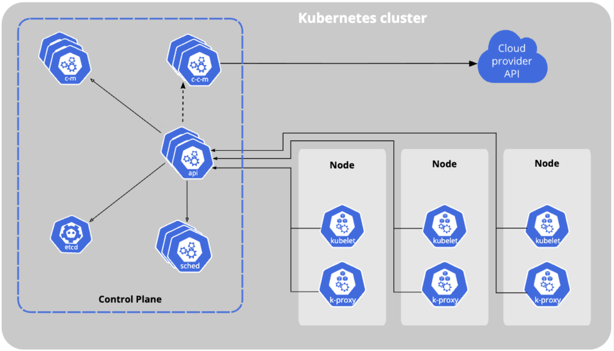

# 5. 클라우드 컨트롤러 매니저

**클라우드별 컨트롤 로직**을 포함하는 쿠버네티스 컨트롤 플레인 컴포넌트이다. 클라우드 컨트롤러 매니저를 통해 **클러스터를 클라우드 공급자의 API에 연결**하고, 해당 클라우드 플랫폼과 상호 작용하는 컴포넌트와 클러스터와만 상호 작용하는 컴포넌트를 구분할 수 있게 해 준다.

핵심 비유를 하자면, 클라우드 컨트롤러 매니저는 **쿠버네티스라는 '표준 규격 건물'과 AWS, GCP, Azure 같은 '특정 도시의 인프라(전기, 수도, 도로)'를 연결해주는 전문 중개인**이다.

>[!note] 컨트롤 플레인이란?
>쿠버네티스 클러스터의 **'두뇌' 또는 '관제탑'** 역할을 하는 핵심 구성 요소들의 집합이다.
>컨트롤 플레인은 클러스터가 사용자가 원하는 상태(Desired State)를 유지하도록 지속적으로 작동한다.
>

## 5.1. 클러스터를 클라우드 공급자의 API에 연결

- 쿠버네티스는 자체적으로 "로드밸런서가 필요해" 또는 "이 파드(Pod)를 위한 저장 공간(Volume)이 필요해"와 같은 **표준화된 요청**을 진행.
    
- 하지만 쿠버네티스 자체는 AWS에서 로드밸런서를 _어떻게_ 만드는지, GCP에서 디스크를 _어떻게_ 붙이는지 모른다. 왜? 클라우드마다 API와 작동 방식이 전부 다르기 때문.
    
- **CCM의 역할:**
    
    1. 쿠버네티스의 이 **'표준 요청'**을 감지.
        
    2. 이 요청을 **'해당 클라우드가 알아들을 수 있는 언어(API 호출)'**로 번역하여 클라우드 공급자에게 전달.
        
    3. 클라우드 공급자(예: AWS)가 실제로 로드밸런서(ELB)나 스토리지(EBS)를 생성.
        
    4. CCM은 생성된 클라우드 자원의 정보를 다시 쿠버네티스에 알려주어 서로 연결.
        

**[예시]**

1. 사용자가 `type: LoadBalancer` 속성을 가진 쿠버네티스 '서비스'를 생성.
    
2. CCM(예: AWS CCM)이 이 요청을 보고, AWS API를 호출하여 AWS Elastic Load Balancer(ELB)를 생성.
    
3. 생성된 ELB의 IP 주소를 가져와서 쿠버네티스 '서비스' 객체에 업데이트.
    

### 5.2. 컴포넌트 구분

"상호 작용하는 컴포넌트와 클러스터와만 상호 작용하는 컴포넌트를 구분"한다는 것은 **쿠버네티스의 이식성(Portability)**을 위한 핵심 설계.

- **구분 전 (과거):** 초기 쿠버네티스는 모든 클라우드(AWS, GCP...)의 코드가 `kube-controller-manager`라는 **하나의** 핵심 컴포넌트에 섞여 있었음.
    
    - **문제점:** AWS 코드를 수정해도 쿠버네티스 전체를 다시 빌드해야 했고, 새로운 클라우드(예: Azure)를 추가하려면 쿠버네티스 핵심 코드를 건드려야 했음. 코드가 비대해지고 의존성이 심해짐.
        
- **구분 후 (현재):**
    
    - **`kube-controller-manager` (핵심 컨트롤러):** 클라우드와 _전혀 상관없는_ 순수 쿠버네티스 로직만 담당. (예: 파드가 죽으면 다시 살리기, 디플로이먼트 관리 등)
        
    - **`cloud-controller-manager` (클라우드 컨트롤러):** 위에서 설명한 것처럼 _오직_ 외부 클라우드 API와 통신하는 로직만 담당.
        

**이 구분의 최대 장점:**

1. **이식성:** 쿠버네티스 핵심부는 특정 클라우드에 종속되지 않고 표준을 유지할 수 있음.
    
2. **유연성:** AWS에서 만든 클러스터를 GCP나 온프레미스(사내 구축형) 환경으로 이전하기 쉬워짐. 해당 환경에 맞는 CCM만 교체해주면 되기 때문.
    
3. **독립적 개발:** AWS는 AWS CCM만 개발하고, GCP는 GCP CCM만 개발하면 됨. 쿠버네티스 핵심 코드와 독립적으로 업데이트할 수 있음.
    

---

### 5.3. 클라우드 컨트롤러 매니저 의 주요 컨트롤러 3가지

클라우드 컨트롤러 매니저는 보통 다음 3가지 일을 하는 하위 컨트롤러로 구성.

1. **노드 컨트롤러 (Node Controller):**
    
    - 클라우드 공급자(예: AWS)에 "현재 실행 중인 VM(EC2 인스턴스) 목록 줘"라고 물어봄.
        
    - 쿠버네티스 '노드' 목록과 비교하여, VM이 삭제되었는데 노드가 남아있으면 제거하는 등 상태를 동기화.
        
2. **라우트 컨트롤러 (Route Controller):**
    
    - 클러스터 내의 여러 노드 간에 네트워크 통신이 가능하도록 클라우드 공급자의 가상 네트워크(VPC) 라우팅 규칙을 설정.
        
3. **서비스 컨트롤러 (Service Controller):**
    
    - 위에서 든 예시처럼, `type: LoadBalancer`나 `type: NodePort` 같은 쿠버네티스 서비스를 클라우드 공급자의 실제 로드밸런서나 방화벽 규칙과 연결.
