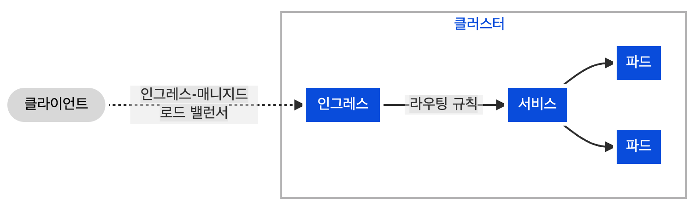
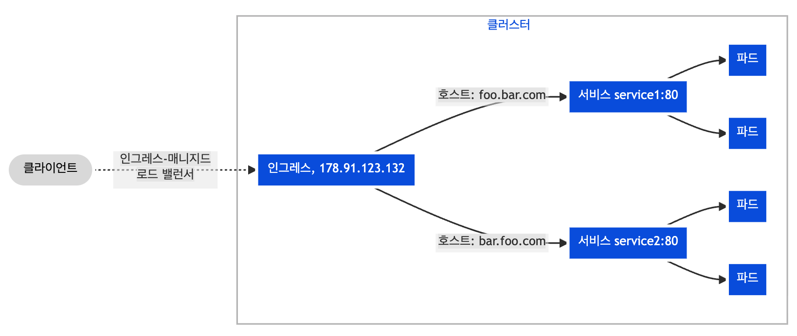

## Ingress 란?

Ingress는 클러스터 외부에서 클러스터 내부 서비스로 HTTP와 HTTPS 경로를 노출한다. 

트래픽 라우팅은 인그레스 리소스에 정의된 규칙에 의해 컨트롤된다.




인그레스는 **외부에서 서비스로 접속이 가능한 URL(HTTPS)** , 로드 밸런스 트래픽, SSL / TLS 종료 그리고 이름-기반의 가상 호스팅을 제공하도록 구성할 수 있다. **인그레스 컨트롤러** 는 일반적으로 **로드 밸런서를 사용해서 인그레스를 수행** 할 책임이 있으며, 트래픽을 처리하는데 도움이 되도록 에지 라우터 또는 추가 프런트 엔드를 구성할 수도 있다.

> Ingress는 임의의 포트 또는 프로토콜을 노출시키지 않는다. 


## Ingress 를 사용하기 위한 전제조건


>[!Caution]
> 인그레스 컨트롤러가 있어야 Ingress를 사용할 수 있다. Ingress.yaml만 생성해 적용하면 아무 효과 없음.


ingress-nginx와 같은 인그레스 컨트롤러를 배포해야 할 수도 있다. 여러 인그레스 컨트롤러 중에서 선택할 수도 있다.

이상적으로, 모든 인그레스 컨트롤러는 참조 사양이 맞아야 한다. 실제로, 다양한 인그레스 컨트롤러는 조금 다르게 작동한다.

> 인그레스 리소스 예시 - 직접 보여드릴예정...


## Resource 백엔드 사용 vs Ingress 만 사용

Service 백엔드 (일반적인 방식):
```
Ingress → Service → Pod
```
Resource 백엔드:
```
Ingress → CustomResource (직접)
```

### 왜 직접 전달하는 기능이 있을까?

일반적인 방식은 Pod에 도착하는 것이 제 1 목표.

하지만 Pod에 도착하는 것이 목표가 아니라면 - S3와 같은 외부 스토리지에 바로 연결하고 싶다면?

목적지가 **Pod가 아니니까, Service에 연결하는 방식을 사용하지 않음**. -> Resource라는 방식 추가.


## Kubernetes Ingress 경로 유형 (pathType)

Ingress에서 요청 경로를 어떻게 매칭할지 결정하는 3가지 유형이 있습니다.

## 1. Exact (정확한 일치)

```yaml
- path: /api/users
  pathType: Exact
  backend: ...
```

**정확히 일치하는 경로만 매칭:**
- ✅ `/api/users` → 매칭
- ❌ `/api/users/` → 매칭 안 됨
- ❌ `/api/users/123` → 매칭 안 됨

## 2. Prefix (접두사 일치)

```yaml
- path: /api
  pathType: Prefix
  backend: ...
```

**경로로 시작하는 모든 요청 매칭:**
- ✅ `/api` → 매칭
- ✅ `/api/users` → 매칭
- ✅ `/api/users/123` → 매칭
- ❌ `/application` → 매칭 안 됨

## 3. ImplementationSpecific (구현 의존)

```yaml
- path: /icons
  pathType: ImplementationSpecific
  backend: ...
```

**Ingress Controller 구현에 따라 다름** (보통 Prefix 처럼 동작)
- nginx: Prefix 처럼 동작
- 다른 Controller마다 다를 수 있음

## 우선순위

매칭 우선순위:
```
Exact > Prefix > ImplementationSpecific
```

## 실제 예시

```yaml
rules:
  - http:
      paths:
        - path: /api/users/123
          pathType: Exact
          backend: user-detail-service
        
        - path: /api/users
          pathType: Prefix
          backend: user-list-service
        
        - path: /static
          pathType: Prefix
          backend: static-files-service
```

요청 `/api/users/123` → **Exact**로 먼저 매칭되므로 user-detail-service로 이동


## 특수 Ingress 유형들

### 이름 기반의 가상 호스팅

이름 기반의 가상 호스트는 동일한 IP 주소에서 여러 호스트 이름으로 HTTP 트래픽을 라우팅하는 것을 지원한다.




``` YAML
apiVersion: networking.k8s.io/v1
kind: Ingress
metadata:
  name: name-virtual-host-ingress
spec:
  rules:
  - host: foo.bar.com
    http:
      paths:
      - pathType: Prefix
        path: "/"
        backend:
          service:
            name: service1
            port:
              number: 80
  - host: bar.foo.com
    http:
      paths:
      - pathType: Prefix
        path: "/"
        backend:
          service:
            name: service2
            port:
              number: 80
```

>[!Note]
> 만약 규칙에 정의된 호스트 없이 인그레스 리소스를 생성하는 경우, 이름 기반 가상 호스트가 없어도 인그레스 컨트롤러의 IP 주소에 대한 웹 트래픽을 일치 시킬 수 있다.

예를 들어, 다음 인그레스는 first.bar.com에 요청된 트래픽을 service1로, second.bar.com는 service2로, 그리고 요청 헤더가 **first.bar.com 또는 second.bar.com에 해당되지 않는 모든 트래픽을 service3로 라우팅** 한다.

``` YAML
apiVersion: networking.k8s.io/v1
kind: Ingress
metadata:
  name: name-virtual-host-ingress-no-third-host
spec:
  rules:
  - host: first.bar.com
    http:
      paths:
      - pathType: Prefix
        path: "/"
        backend:
          service:
            name: service1
            port:
              number: 80
  - host: second.bar.com
    http:
      paths:
      - pathType: Prefix
        path: "/"
        backend:
          service:
            name: service2
            port:
              number: 80
  - http:
      paths:
      - pathType: Prefix
        path: "/"
        backend:
          service:
            name: service3
            port:
              number: 80
```

