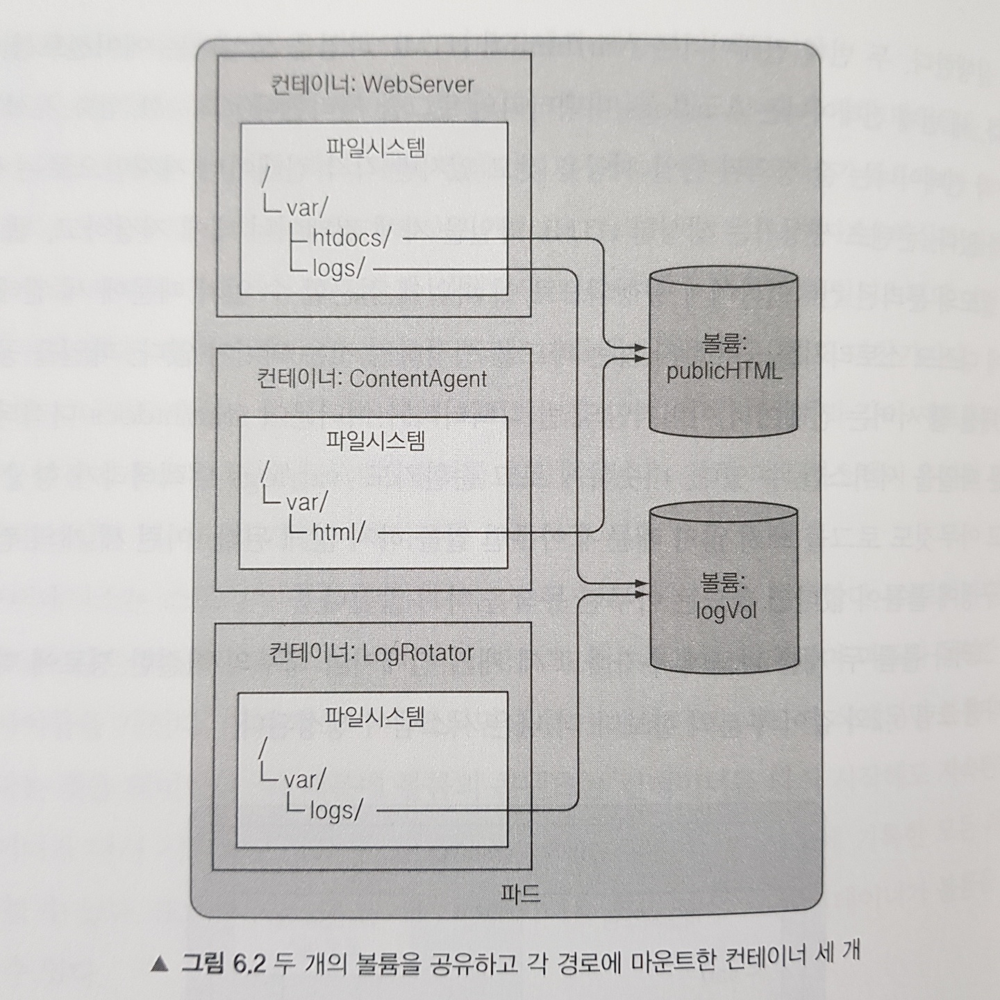

### 볼륨이란?

쿠버네티스 아키텍쳐에서 **컨테이너**는 본질적으로 비영속적이다. 이 말은, 컨테이너가 실행 중 생성하거나 수정한 모든 데이터는 컨테이너가 중지되거나 크래시되어 재시작되면 **전부 유실된다는** 의미다.

컨테이너는 이미지를 기반으로 항상 초기화된 상태로 다시 시작한다.

또한 쿠버네티스는 파드라는 단위로 컨테이너를 관리하며, 하나의 파드는 하나 이상의 컨테이너를 포함할 수 있다. 이 파드 내의 컨테이너들이 특정 파일이나 데이터를 공유해야 하는 시나리오가 발생하지만, 컨테이너는 각자 격리된 파일 시스템을 가진다.

---

**쿠버네티스 볼륨은 위의 문제를 해결하기 위해 등장했다.**

1. 데이터 영속성 보장
   - 볼륨은 컨테이너의 수명 주기가 아닌, **파드의 수명 주기에 바인딩된다.**
   - 파드에 볼륨을 정의하고 컨테이너가 해당 볼륨을 마운트하면, 해당 컨테이너가 재시작되더라도 볼륨에 저장된 데이터는 유실되지 않고 보존된다.
2. 데이터 공유
   - 파드 내의 모든 컨테이너는 동일한 볼륨을 공유하도록 설정할 수 있다.
   - 각 컨테이너는 볼륨을 자신의 파일 시스템 경로에 마운트하여 데이터를 읽고 쓸 수 있따.

---

물론 도커도, AWS도 볼륨 개념을 가지고 있다.

쿠버네티스는 이를 한 단계 더 추상화해, 다양한 스토리지 백엔드를 일관된 방식으로 파드에 연결할 수 있도록 지원한다.

파드는 여러 볼륨 유형을 동시에 사용할 수 있다.

- 임시, 퍼시스턴트 볼륨 유형으로 나뉘며, 파드 내 컨테이너가 재시작되어도 데이터는 보존되지만, 파드가 더 이상 존재하지 않을 시 전자는 삭제하지만, 후자는 삭제하지 않는다.

기본적으로 볼륨은 디렉터리이다. 일부 데이터가 있을 수도 있으며, 파드 내 컨테이너에서 접근할 수 있다.

- 디렉터리의 생성 방식, 지원 매체/내용은 유형에 따라 결정된다.

---

볼륨을 사용하려면, `.spec.volumes` 에서 파드에 제공할 볼륨을 지정하고  `.spec.containers[*].volumeMounts` 의 컨테이너에 해당 볼륨을 마운트할 위치를 선언한다.

---

간단하게 예시를 봐보자.

어떤 파드에 Web Server, Content Agent, Log Rotator 기능을 하는 컨테이너 3개가 존재한다고 해보자.

- Web Server는 **`/var/htdocs`** 디렉터리에 HTML 페이지를 서빙하고, **`/var/logs`** 에 액세스 로그를 기록한다.
- Content Agent는 Web Server가 서빙할 HTML 파일을 **`/var/html`** 에 생성한다.
- Log Rotator는 **`/var/logs`** 디렉터리의 로그를 처리한다.

이 컨테이너들이 서로의 파일 시스템을 공유할 수 있게 다음과 같이 `publicHTML`, `logVol` 두 볼륨을 추가할 수 있다.



위 사례에서 두 볼륨은 빈 상태로 초기화되므로, `emptyDir`이란 유형의 볼륨을 사용할 수 있다.

쿠버네티스에선 다양한 유형의 볼륨도 지원한다.

볼륨을 채우거나 마운트하는 프로세스는 파드의 컨테이너가 시작되기 전에 수행된다.

---

### 볼륨 유형들

공식문서에선 바로 볼륨 유형들에 대해 나온다. 하지만 문서를 보다보면 상당수가 deprecated 된 것을 볼 수 있다.

이전에는 모든 볼륨 플러그인이 `인-트리(in-tree)`에 있었기 때문이다. 이는 쿠버네티스 코드 내부에 클라우드 공급자별 스토리지 코드를 포함하던 것이었다.

하지만 현재는 `CSI(Container Storage Interface)` 을 통해 쿠버네티스 코드 베이스와는 독립적으로 볼륨 플러그인을 개발하고, 쿠버네티스 클러스터의 확장으로 배포(설치) 할 수 있다.

즉, 중요한 것은 이런 모든 유형들이 컨테이너 내부에서 볼륨이 작동하는 방식에 영향을 미치지 않는다는 것이다.

볼륨 목록

- 이는https://kubernetes.io/ko/docs/concepts/storage/volumes/#volume-types여기서 확인해볼 수 있다.

이 중에서 쉽게 접해볼 수 있는 것들을 알아보자.

---

### **emptyDir**

> 일시적인 데이터를 저장하는 데 사용되는 간단한 빈 디렉터리다.

- **생명주기**
  - **파드 생성 시:** `emptyDir` (빈 디렉터리) 생성.
  - **컨테이너 크래시/재시작 시:** 데이터 **유지** (파드는 살아있으므로).
  - **파드 삭제/재생성 시:** 데이터 **영구 삭제** 후 새로운 빈 디렉터리 생성.
- **주요 용도**
  1. **파드 내 컨테이너 간 데이터 공유:**
     - A 컨테이너가 데이터를 다운로드하여 `emptyDir`에 저장.
     - B 컨테이너가 `emptyDir`의 해당 데이터를 읽어 처리.
  2. **임시 작업 공간 (스크래치 공간):**
     - 계산 중간 결과, 임시 캐시 파일 등을 저장.
     - 컨테이너가 재시작되어도 유지되지만, 파드가 재생성되면 사라져도 무방한 데이터에 사용.
- **저장 위치 (매체)**
  - **기본 (디스크):** `emptyDir: {}`
    - 파드가 실행되는 노드의 디스크(HDD/SSD)에 생성된다.
  - **메모리:** `emptyDir: { medium: Memory }`
    - 노드의 RAM(`tmpfs`)에 생성된다. 매우 빠르다.
    - 단, 컨테이너의 메모리 사용량 제한에 포함된다.
- **주의 사항**
  - **파드 재시작/재생성 시 데이터 소멸:** 파드가 삭제되고 새로 생성되면 (예: 이미지 업데이트, 노드 재스케줄링 등) 데이터는 완전히 사라진다.
  - **초기 파일 부재:** 처음 생성 시 완전히 비어있으므로, 애플리케이션이 특정 파일 존재를 가정하면 오류가 발생할 수 있다. 읽기 전 파일 존재 여부를 확인하거나 예외 처리가 필요하다.
  - **영구 보존**이 필요한 데이터에는 절대 사용해선 안 된다:
    - 데이터베이스 데이터 (X)
    - 중요 로그 (X)
    - 사용자 업로드 파일 (X)

`emptyDir`는 "컨테이너 재시작에는 살아남지만, 파드와 운명을 함께하는 임시 폴더"로 이해하면 된다.

**YAML 구성 예시**

```yaml
apiVersion: v1
kind: Pod
metadata:
  name: test-emptydir
spec:
  containers:
    - image: nginx
      name: nginx-container
      volumeMounts:
        - mountPath: /cache # 컨테이너가 사용할 경로
          name: cache-volume
  volumes:
    - name: cache-volume
      emptyDir: {} # 여기에 medium: Memory 를 추가할 수 있다
```

**강의 예시**

```yaml
apiVersion: apps/v1
kind: Deployment
metadata:
  name: story-deployment
spec:
  template:
    spec:
      containers:
        - name: story
          image: story-app:1
          volumeMounts:
            - mountPath: /app/story # 애플리케이션이 데이터를 쓰는 경로
              name: story-volume
      volumes:
        - name: story-volume
          emptyDir: {} # 기본 설정으로 디스크 기반 빈 디렉터리 생성
```

이 구성의 특징은 아래와 같다.

- 컨테이너가 `/app/story`에 파일을 작성하면 `emptyDir` 볼륨에 저장됨
- 컨테이너가 크래시되어 재시작되어도 데이터는 유지됨
- 파드 자체가 삭제되면 데이터도 함께 사라짐

---

### **hostPath**

> hostPath 볼륨은 호스트 노드의 파일시스템에 있는 파일이나 디렉터리를 파드에 마운트한다.

- **핵심 동작**
  - 파드가 노드의 `/data` 디렉터리를 `hostPath`로 마운트하면, 파드 내부에서 해당 노드의 `/data` 내용을 직접 읽고 쓸 수 있다.
    
  - 데이터는 파드가 삭제되어도 노드에 그대로 남는다.
    - `emptyDir`처럼 파드가 종료되면 삭제되는 볼륨과 달리, 콘텐츠가 볼륨 내에서 사라지지 않는다.
  - **`emptyDir`과의 차이점:**
    - `emptyDir`은 **Pod별로** 새로운 빈 디렉터리를 생성하므로, 같은 노드에 있어도 각 파드는 독립적인 볼륨을 갖는다.
    - `hostPath`는 **노드의 특정 경로를 공유**하므로, 같은 노드의 여러 파드가 동일한 데이터에 접근할 수 있다.
    - 이는 여러 복제본(replicas)을 실행할 때 유용하다. 한 파드가 크래시되어 트래픽이 다른 파드로 리디렉션되어도, 같은 노드라면 동일한 데이터를 읽을 수 있기 때문이다.
- **한계: 노드 종속성**
  - **단일 노드 클러스터(예: Minikube)에서는** 모든 파드가 같은 노드에서 실행되므로 `hostPath`로 데이터를 공유할 수 있다.
  - **다중 노드 클러스터에서는** 이 데이터가 해당 노드에 종속된다. 파드가 다른 노드로 스케줄링되면, 이전 노드에 있던 `hostPath` 데이터에는 접근할 수 없다.
  - 즉, 같은 노드의 파드만 이 데이터에 액세스할 수 있다.
  - 다중 노드 클러스터에서 진정한 퍼시스턴트 데이터를 저장하려면 다른 솔루션이 필요하다.
- **경고: 심각한 보안 위험**
  - `hostPath`는 **심각한 보안 위험을 내포**하므로 사용을 극도로 제한해야 한다.
  - 컨테이너가 호스트의 중요 디렉터리(예: `/`, `/etc`, `/root`)에 접근하도록 허용하면, 컨테이너 이스케이프(Container Escape)의 발판이 될 수 있다.
  - 특히 `/var/run/docker.sock` 파일을 마운트하면, 컨테이너가 호스트의 도커 데몬을 제어하여 클러스터 전체를 장악할 수 있다.
- **유효한 사용 시나리오:**
  1. **노드 모니터링:** `cAdvisor`나 `Prometheus node-exporter`처럼, 노드 자체의 정보를 읽어야 하는 에이전트.
  2. **시스템 데몬:** `kube-proxy`, CNI 플러그인(네트워킹) 등 노드 레벨에서 작동해야 하는 쿠버네티스 시스템 구성 요소.
  3. **기존 데이터 공유:** 호스트 머신에 이미 존재하는 데이터를 컨테이너에 제공해야 하는 경우. 호스트의 `/data` 폴더에 특정 데이터가 이미 있다면, 이 데이터는 처음부터 컨테이너의 마운트 경로에서도 사용할 수 있다. 이는 항상 새로운 빈 디렉터리를 생성하는 `emptyDir`과의 또 다른 차이점이다.
  4. **개발 환경:** 단일 노드 환경(Minikube 등)에서 여러 복제본이 동일한 데이터에 접근해야 하는 경우.
     즉, 노드 자체를 관리하거나 특정 데이터를 공유해야 하는 경우에만 한정적으로 사용하지, 평소에는 사용하지 않는다.
- **YAML 구성 예시:**
  ```yaml
  apiVersion: v1
  kind: Pod
  metadata:
    name: test-hostpath
  spec:
    containers:
      - image: busybox
        name: test-container
        args: ["sleep", "3600"]
        volumeMounts:
          - mountPath: /host-logs # 컨테이너 내부 경로
            name: logs-volume
    volumes:
      - name: logs-volume
        hostPath:
          path: /var/log # 실제 호스트 노드의 경로
          type: Directory # 해당 경로가 '디렉터리'여야 함 (없으면 실패)
  ```
- **type 옵션:**

  - `Directory`: 지정된 경로가 디렉터리로 존재해야 함 (없으면 파드 생성 실패).
  - `DirectoryOrCreate`: 디렉터리가 없으면 자동으로 생성함 (권한 0755, kubelet 소유).
  - `File`, `FileOrCreate`: 파일에 대한 유사한 동작.
  - 기타 옵션은 [공식 문서](https://kubernetes.io/docs/concepts/storage/volumes/#hostpath)에서 확인 가능하다.

- **강의 예시: Story 애플리케이션 - 다중 복제본**
  ```yaml
  apiVersion: apps/v1
  kind: Deployment
  metadata:
    name: story-deployment
  spec:
    replicas: 2 # 여러 복제본 실행
    template:
      spec:
        containers:
          - name: story
            image: story-app:1
            volumeMounts:
              - mountPath: /app/story # 컨테이너 내부 경로
                name: story-volume
        volumes:
          - name: story-volume
            hostPath:
              path: /data # 호스트 노드의 경로
              type: DirectoryOrCreate # 없으면 생성
  ```
  이 구성에서:
  - 같은 노드의 2개 복제본이 모두 호스트의 `/data` 경로를 공유함
  - 한 파드가 크래시되어 트래픽이 다른 파드로 가도, 동일한 데이터에 접근 가능
  - 하지만 파드가 다른 노드로 스케줄링되면 해당 데이터에 접근 불가

---

### **CSI (Container Storage Interface)**

위에서 간단하게 말을 했지만, 조금 더 살펴보자.

공식문서에서 볼륨 유형 목록을 살펴보면, 일부는 매우 특정적이라는 것을 알 수 있다.

- `awsElasticBlockStore`: AWS Elastic Block Store 서비스 전용
- `azureDisk`, `azureFile`: Azure 스토리지 서비스 전용
- `gcePersistentDisk`: Google Cloud Persistent Disk 전용

이런 식으로 각 클라우드 프로바이더와 스토리지 솔루션마다 별도의 볼륨 유형이 존재했다.

**하지만 문제가?!**

- 새로운 스토리지 솔루션이 등장할 때마다 쿠버네티스 코어에 새로운 볼륨 유형을 추가해야 했다.
- 쿠버네티스 팀이 모든 클라우드 프로바이더의 스토리지 구현을 관리해야 했다.
- 확장성이 떨어졌다.

**CSI는 이 문제를 해결하기 위해 등장했다.**

CSI(Container Storage Interface)는 비교적 새로운 볼륨 유형으로, **명확하게 정의된 표준 인터페이스**를 제공한다.

- 쿠버네티스는 CSI 인터페이스만 제공한다.
- 각 스토리지 벤더(AWS, Azure, GCP 등)가 이 인터페이스를 구현하는 **드라이버**를 개발한다.
- 이론적으로는 자체 데이터 센터를 위한 커스텀 CSI 드라이버도 작성할 수 있다.

**예시: AWS EFS (Elastic File System)**

예를 들어, AWS에 쿠버네티스 클러스터를 배포하고 AWS EFS를 스토리지로 사용하고 싶다고 해보자.

- 쿠버네티스에는 `awsElasticBlockStore` 유형은 있지만, EFS 전용 유형은 없다.
- EFS는 네트워크 파일 시스템이므로 `nfs` 유형으로 작동시킬 수도 있지만, 추가 설정이 필요하다.
- **더 나은 방법:** AWS 팀이 공식적으로 제공하는 **AWS EFS CSI 드라이버**를 사용하는 것이다.
  - [AWS EFS CSI Driver GitHub](https://github.com/kubernetes-sigs/aws-efs-csi-driver)에서 설치 및 사용 방법을 확인할 수 있다.

**CSI의 장점**

1. **확장성:** 쿠버네티스 코어를 수정하지 않고도 새로운 스토리지 솔루션을 지원할 수 있다.
2. **유연성:** 전 세계 모든 스토리지 솔루션을 CSI 드라이버로 연결할 수 있다.
3. **독립적 개발:** 스토리지 벤더가 독립적으로 드라이버를 개발하고 업데이트할 수 있다.
4. **표준화:** 동일한 인터페이스를 사용하므로 사용법이 일관적이다.

**언제 CSI를 사용하는가?**

- 로컬 개발 환경(Minikube 등)에서는 `emptyDir`이나 `hostPath`로 충분하다.
- **프로덕션 환경**에서 클라우드 프로바이더(AWS, Azure, GCP 등)의 스토리지 서비스를 사용할 때 CSI 드라이버를 활용한다.
- 특히 다중 노드 클러스터에서 영구 데이터를 저장해야 할 때 필수적이다.

**주요 CSI 드라이버 예시:**

- **AWS:** EFS CSI, EBS CSI
- **Azure:** Azure Disk CSI, Azure File CSI
- **GCP:** GCE Persistent Disk CSI
- **기타:** Ceph, NFS, iSCSI 등 다양한 드라이버 존재

<aside>

CSI는 현대 쿠버네티스 스토리지의 핵심이다. 기존 `인-트리` 볼륨 유형들은 점차 deprecated 되고 있으며, CSI 드라이버로 대체되고 있다.

</aside>

---

그렇다면 CSI 드라이버가 있으니, 파드(Pod)에 AWS EBS 같은 스토리지를 바로 연결해서 쓰면 되지 않을까? 물론 가능하다. 하지만 이 방식은 운영상 치명적인 단점이 있다.

**문제점 1: 파드와 인프라의 강한 결합 (Tightly Coupled)**

개발자가 파드를 배포하기 위해 인프라의 구체적인 정보를 알아야 한다.

```yaml
# 개발자가 작성해야 하는 Pod Spec (나쁜 예)
volumes:
  - name: my-data
    awsElasticBlockStore: # AWS라는 특정 기술에 종속됨
      volumeID: vol-092384 # 구체적인 볼륨 ID를 알아야 함
      fsType: ext4
```

만약 회사가 AWS에서 Google Cloud로 이사를 간다면? 개발자는 모든 파드의 YAML 파일을 열어서 `awsElasticBlockStore`를 `gcePersistentDisk`로 수정해야 한다. 이식성(Portability)이 완전히 깨지는 것이다.

**문제점 2: 역할 분담의 실패**

- **개발자:** "나는 애플리케이션 로직만 짜고 싶은데, 왜 스토리지 ID나 파일 시스템 타입까지 신경 써야 하지?"
- **관리자:** "스토리지 설정은 보안과 성능에 직결되는데, 개발자가 임의로 설정하게 두면 위험하다."

애플리케이션 영역(Pod)과 인프라 영역(Storage)이 섞여 있어서 관리가 불가능해진다.

쿠버네티스는 이 문제를 어떻게 해결했을까?
