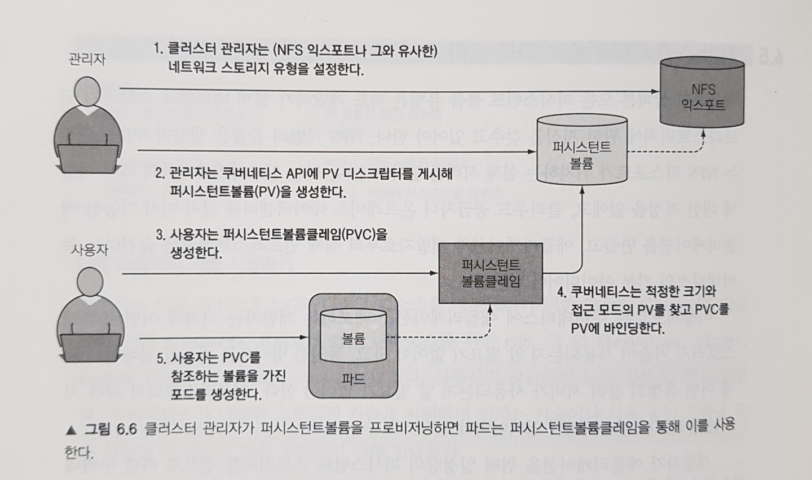

공식문서에 나온 내용을 기술하기에 앞서, 지난 `볼륨`에서 마지막에 언급했던 내용을 이어나간다.

쿠버네티스 관리자가 수동으로 클라우드 디스크를 만들고, 개발자가 그것을 파드에 직접 연결하는 과정은 쿠버네티스의 철학을 위반하는 것이다.

쿠버네티스에 애플리케이션을 배포하는 관리자는 사용하는 스토리지의 구체적인 기술을 알고 싶지 않아한다.

- 이는 곧 클러스터 관리자만의 역할이다.

개발자 / 클러스터 관리자의 영역을 분리해야 한다. How?

---

**역할의 분리**

- **관리자 (Infrastructure Provider):** 실제 물리 스토리지(GCE, AWS 등)를 준비하고 이를 쿠버네티스에 `PV`로 등록한다. "여기에 10GB짜리 공간이 있다"라고 공지하는 것과 같다.
- **개발자 (User):** 물리 스토리지가 뭔지 알 필요 없다. 그저 필요한 용량과 접근 모드를 명시하여 `PVC`를 생성한다. "나는 1GB 공간이 필요하다"라고 신청서를 내는 것이다.
- **쿠버네티스 (System):** 개발자의 요청서(PVC)를 보고, 조건이 맞는 대기 중인 스토리지를 명세한 내역(PV)을 찾아 연결(Binding)해준다.
  - PV는 실제 스토리지로 가는 '지도(Map)' 또는 '연결 고리(Connector)' 역할을 하는 쿠버네티스 객체(Object)다.

PV, PVC라는 개념이 등장한다. 아래 그림을 봐보자.



<aside>

**Step 1: PV 생성 (관리자의 업무)**

> 관리자는 실제 스토리지 세부 정보(GCE PD 등)를 담은 PV를 생성한다.

```yaml
apiVersion: v1
kind: PersistentVolume
metadata:
  name: mongodb-pv
spec:
  capacity:
    storage: 1Gi # 용량 정의
  accessModes:
    - ReadWriteOnce # 접근 모드 (한 노드에서 읽기/쓰기)
    - ReadOnlyMany
  persistentVolumeReclaimPolicy: Retain # PVC 삭제 시 데이터 보존 정책
  gcePersistentDisk: # [중요] 실제 인프라 정보는 여기에만 존재한다.
    pdName: mongodb
    fsType: ext4
```

`gcePersistentDisk` 같은 구체적인 인프라 정보가 파드가 아닌 PV 설정에 숨어 있다. 이것이 추상화의 시작이다.

이때, accessModes에 대해서도 공식문서에서 열심히 다뤄주는데… 간단히 정리하면 아래와 같다.

- **ReadWriteOnce (RWO):** **하나의 노드**에서만 읽기/쓰기 가능. (가장 흔함. 블록 스토리지 특성)
- **ReadOnlyMany (ROX):** 여러 노드에서 **읽기만** 가능.
- **ReadWriteMany (RWX):** 여러 노드에서 읽기/쓰기 가능. (NFS 같은 파일 스토리지여야 가능)
- **주의:** 하나의 파드(Pod)가 아니라 **하나의 노드(Node)** 기준이라는 점이 중요

**Step 2: PVC 생성 (개발자의 업무)**

> 개발자는 인프라 정보 없이 필요한 스펙만 적어 요청한다.

```yaml
apiVersion: v1
kind: PersistentVolumeClaim
metadata:
  name: mongodb-pvc # 나중에 파드가 이 이름을 참조한다.
spec:
  resources:
    requests:
      storage: 1Gi # "1GB 주세요"
  accessModes:
    - ReadWriteOnce # "쓰기 가능한 걸로 주세요"
  storageClassName: "" # (지금은 특정 클래스를 쓰지 않고 정적 바인딩을 위해 비워둠)
```

**바인딩(Binding):** 이 PVC가 생성되면, 쿠버네티스 마스터는 용량(1Gi)과 접근 모드(RWO)를 만족하는 `mongodb-pv`를 자동으로 찾아 둘을 묶어버린다(`Bound` 상태).

<aside>

**[참고] PV의 상태(Status) 변화 흐름**

바인딩이 일어나는 과정에서 PV는 다음과 같은 상태(STATUS)를 거친다. `kubectl get pv` 명령어로 확인했을 때 이 상태를 보고 현재 상황을 파악해야 한다.

- **Available (사용 가능):** 아직 어떤 PVC와도 연결되지 않은 자유로운 상태. (관리자가 막 생성했을 때)
- **Bound (연결됨):** 특정 PVC에 할당되어 사용 중인 상태. (Step 2가 성공했을 때)
- **Released (출시됨):** PVC는 삭제되었으나, 아직 리소스가 반환되지 않은 상태. (데이터는 남아있으나 다른 파드가 바로 재사용은 불가)
- **Failed (실패):** 자동 반환 등의 과정에서 오류가 발생한 상태.
</aside>

**Step 3: 파드에서 사용**

이제 파드는 PVC의 이름만 부르면 된다.

```yaml
apiVersion: v1
kind: Pod
metadata:
  name: mongodb
spec:
  volumes:
    - name: mongodb-data
      persistentVolumeClaim:
        claimName: mongodb-pvc # [중요] GCE 정보 대신 PVC 이름을 적는다.
  containers: ...
```

</aside>

**정리**

| **구분**        | **직접 연결 방식 (Bad)**                    | **PV/PVC 방식 (Good)**                   |
| --------------- | ------------------------------------------- | ---------------------------------------- |
| **YAML 내용**   | `gcePersistentDisk: ...` (인프라 정보 노출) | `claimName: mongodb-pvc` (추상화됨)      |
| **이식성**      | **불가.** GCE 환경에서만 작동.              | **우수.** AWS로 옮겨도 파드 수정 불필요. |
| **개발자 부담** | 디스크 ID, 파일 시스템 등 인프라 지식 필요. | 필요한 용량(Size)만 알면 됨.             |
| **관리**        | 모든 Pod에 중복 설정.                       | PV 하나로 여러 Pod(PVC)가 사용 가능.     |
| **독립성**      | Pod에 종속적.                               | Pod와 노드에 독립적 (볼륨 유형에 따라).  |

PV와 PVC를 사용하면 초기 설정 단계(PV 생성)가 추가되어 번거로워 보일 수 있다.

하지만 이를 통해 애플리케이션(Pod)과 인프라(Storage)가 완벽하게 분리되어, 개발자는 인프라 변경 사항에 신경 쓰지 않고 애플리케이션 개발에만 집중할 수 있게 된다.

---

### **PersistentVolume 반환 정책 (Reclaim Policy)**

이전 `persistentVolumeReclaimPolicy: Retain  # PVC 삭제 시 데이터 보존 정책` 이 spec에 적힐 것을 알 수 있다.

- 이와 같이 사용자가 볼륨을 다 사용하고나면 리소스를 반혼할 수 있는 API를 사용하여 PVC 오브젝트를 삭제할 수 있다.
- 퍼시스턴트 볼륨 반환 정책은 볼륨에서 클레임을 해제한 후 볼륨에 수행할 작업을 클러스터에 알려준다.

반환 정책으로는 **Retain, Recycle(Deprecated), Delete가 있다.**

**Retain**

`Retain` 반환 정책은 리소스를 수동으로 반환할 수 있게 한다. 퍼시스턴트볼륨클레임이 삭제되면 퍼시스턴트볼륨은 여전히 존재하며 볼륨은 "릴리스 된" 것으로 간주된다. 그러나 이전 요청자의 데이터가 여전히 볼륨에 남아 있기 때문에 다른 요청에 대해서는 아직 사용할 수 없다. 관리자는 다음 단계에 따라 볼륨을 수동으로 반환할 수 있다.

1. 퍼시스턴트볼륨을 삭제한다. PV가 삭제된 후에도 외부 인프라(예: AWS EBS, GCE PD, Azure Disk 또는 Cinder 볼륨)의 관련 스토리지 자산이 존재한다.
2. 관련 스토리지 자산의 데이터를 수동으로 삭제한다.
3. 연결된 스토리지 자산을 수동으로 삭제한다.

**동일한 스토리지 자산을 재사용하려는 경우, 동일한 스토리지 자산 정의로 새 퍼시스턴트볼륨을 생성한다.**

**Delete**

`Delete` 반환 정책을 지원하는 볼륨 플러그인의 경우, 삭제는 쿠버네티스에서 퍼시스턴트볼륨 오브젝트와 외부 인프라(예: AWS EBS, GCE PD, Azure Disk 또는 Cinder 볼륨)의 관련 스토리지 자산을 모두 삭제한다. 동적으로 프로비저닝된 볼륨은 [스토리지클래스의 반환 정책](https://kubernetes.io/ko/docs/concepts/storage/persistent-volumes/#%EB%B0%98%ED%99%98-%EC%A0%95%EC%B1%85)을 상속하며 기본값은 `Delete`이다. 관리자는 사용자의 기대에 따라 스토리지클래스를 구성해야 한다. 그렇지 않으면 PV를 생성한 후 PV를 수정하거나 패치해야 한다. [퍼시스턴트볼륨의 반환 정책 변경](https://kubernetes.io/ko/docs/tasks/administer-cluster/change-pv-reclaim-policy/)을 참고하길 바란다.

**Recycle**

deprecated. 동적 프로비저닝을 사용하자.

---

**동적 프로비저닝이 뭔데?**

> 프로비저닝: IT 분야에서 **사용자나 애플리케이션의 요구에 맞게 필요한 시스템 자원(서버, 스토리지, 네트워크 등)을 준비하고 공급하며 설정하는 과정이다.**

스토리지를 준비하는 방법은 크게 2가지다.

- 수동(정적) / 자동(동적)

**정적 프로비저닝 (Static Provisioning) - "구식 수작업"**

- **방식:** 우리가 지금까지 배운 방식이다.
- **과정:** 관리자가 미리 PV(10Gi, 20Gi 등)를 잔뜩 만들어둔다. 개발자는 그 중에 맞는 게 있으면 가져다 쓴다.
- **비유:** 빵집 진열대에 **미리 구워진 빵**을 사는 것과 같다. 100g짜리 빵을 원해도 진열대에 200g짜리밖에 없으면 그걸 사야 한다.
- **단점:** 관리자가 귀찮다. 빵(PV)이 떨어지면 개발자는 굶어야(Pending) 한다.

**동적 프로비저닝 (Dynamic Provisioning) - "주문 제작"**

- **방식:** 관리자가 PV를 미리 만들지 않는다. 대신 '스토리지 클래스(StorageClass)'라는 '레시피'만 정의해둔다.
- **과정:** 개발자가 PVC(주문서)를 내는 순간, 그 즉시 레시피를 보고 PV를 **자동으로 생성**해서 바인딩한다.
- **비유:** 서브웨이 샌드위치다. 주문이 들어오면 그 자리에서 빵을 굽고 재료를 넣어 만들어준다. 재고 걱정이 없고 딱 원하는 크기로 나온다.
- **조건:** `DefaultStorageClass` 어드미션 컨트롤러 설정이 켜져 있어야, 개발자가 클래스를 안 적어도 "기본 빵"으로 만들어준다.

근데 이 부분만 보면 동적 프로비저닝은 “만드는 것”에만 집중된 것 같다.

- 왜 **반환(Reclaiming)** 부분에서 동적 프로비저닝으로 많은 부분을 대체할 수 있을까?

스토리지 클래스(StorageClass)를 이용해 동적으로 생성된 PV는 태생적으로 "자동화된 라이프사이클"을 가지기 때문이다.

- **정적 프로비저닝 (수동):** 관리자가 만들었으니, 지우는 것도 관리자가 알아서 해야 한다.
  - 그래서 보통 `Retain`을 쓴다. 실수로 지워지면 안 되니까.
- **동적 프로비저닝 (자동):** 기계(StorageClass)가 만들었으니, 지우는 것도 기계가 알아서 한다.
  - 그래서 기본값이 `Delete`다.

'자동화 레시피'인 스토리지 클래스(StorageClass)를 실제로 어떻게 정의하고 사용할까?

**StorageClass의 예시**

앞서 동적 프로비저닝을 '레시피'만 정의해두는 것이라고 비유했다. 실제 그 레시피(StorageClass)는 이렇게 생겼다. 관리자는 매번 PV를 만드는 대신, 이 파일 하나만 딱 한 번 만들어두면 된다.

```yaml
apiVersion: storage.k8s.io/v1
kind: StorageClass
metadata:
  name: fast-storage # 개발자가 PVC에서 이 이름을 'storageClassName'에 적으면 된다.
provisioner: kubernetes.io/aws-ebs # [중요] "누가" 빵을 구울 것인가? (AWS, GCE, Azure 등)
parameters:
  type: gp3 # "어떤" 재료를 쓸 것인가? (SSD, HDD 성능 등)
reclaimPolicy: Delete # "다 먹으면 치울까?" (PVC 삭제 시 디스크도 삭제)
```

- **provisioner:** 스토리지 공급자를 지정한다 (AWS EBS, GCE PD 등).
- **parameters:** 클라우드 공급자마다 다른 파라미터(디스크 타입, IOPS 등)를 설정한다.

**결론:** 동적 프로비저닝 환경에서 **관리자**는 `StorageClass` 설정만 해두고 쉬면 되고, **개발자**는 인프라 고민 없이 `PVC`만 요청하면 **쿠버네티스**가 알아서 클라우드 디스크를 생성하고 연결해준다. 이것이 클라우드 네이티브 스토리지 관리의 완성이다.
