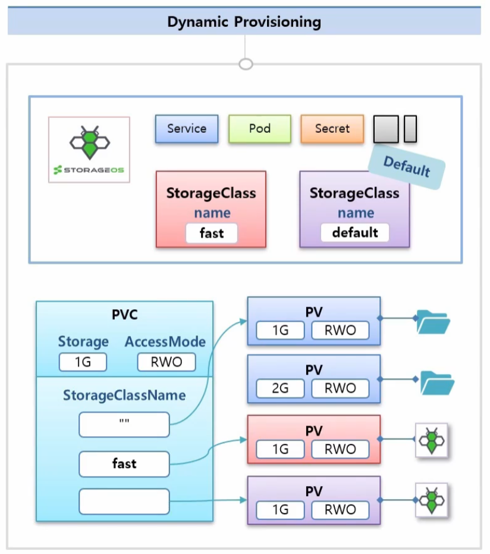

사용자가 스토리지를 요청할 때마다 스토리지를 자동으로 생성해서 제공해주는 기능 → Static provisioning과 반대되는 개념

<aside>

Provisioning: 스토리지를 실제로 생성해서 제공한다.

- 스토리지 할당
- 스토리지 생성
- 볼륨 마련

등의 과정을 말한다.

</aside>



- 동작 흐름

  1. 관리자가 PV Provisioner를 배포하고, 여러개의 StorageClass 객체를 미리 정의

     대부분의 클라우드는 Provisioner를 포함하기 때문애, PVC에서 StorageClass만 정의하면 클레임 요청시 시스템이 자동으로 PV를 생성한다.

     ```yaml
     apiVersion: storage.k8s.io/v1
     kind: StorageClass
     metadata:
     name: slow
     provisioner: kubernetes.io/gce-pd
     parameters:
     type: pd-standard
     ```

     어떤 스토리지 드라이브이고, 어떤 옵션으로 생성할지를 미리 StorageClass 객체로 정해둔다.

  2. 사용자가 PVC를 작성할 때 storageClassName 필드에 원하는 이름을 명시하면, 쿠버네티스가 해당 StorageClass에 정의된 provisioner를 사용해 실제 PV를 생성
     - PVC에서 storageClassName을 지정하지 않으면, 클러스터에 Default로 설정된 StorageClass가 자동으로 적용
  3. 생성된 PV는 자동으로 그 PVC에 바인딩되고, 사용자는 해당 PVC를 Pod에 마운트해서 사용

- StorageClass가 없으면 PV 자동 생성이 불가능하다.
- 멀티존(다중 AZ) 환경에서는 `volumeBindingMode: WaitForFirstConsumer` 같은 설정을 통해 Pod 스케줄 위치에 맞춘 볼륨 생성이 가능하다.
  장애 격리를 위해서 노드들은 특정 AZ(Availability Zone)에 속한다.
  PV 자동 생성 모드에서 PV가 2a 생성되고 쿠버네티스 스케줄러가 Pod를 2b에 배치하력고 하면 연결이 실패한다. → Pod 실행 실패
  그렇기 때문에 Pod가 실제로 어디에 배치될지 보고 난 후, 그 노드가 위치한 AZ에 맞춰 PV를 생성할 수 있도록 옵션을 설정한다.
